# Jenkins
Para los ingenieros que han trabajado en un entorno de red grande, comprenden que las consecuencias de una modificación de red mal ejecutada pueden ser significativas. Podemos implementar cientos de cambios sin problemas, pero basta con una modificación errónea para que la red tenga un impacto negativo en todo el negocio.

Dada la posible complejidad y el impacto, en muchos entornos de redes se utiliza un Comité Asesor de Cambios (CAB). El proceso típico del CAB es:

1. El ingeniero de redes diseña y documenta los pasos del cambio, incluyendo la razón, dispositivos involucrados, comandos, verificación y resultados esperados.

2. Se solicita una revisión técnica por parte de un compañero, que varía según la complejidad del cambio: simple (un compañero) o complejo (ingeniero senior).

3. El ingeniero presenta el cambio al comité, que realiza preguntas, evalúa el impacto y aprueba o rechaza la solicitud de cambio.

5. El cambio se lleva a cabo durante la ventana de cambio programada, ya sea por el ingeniero original o por otro ingeniero.

Sin embargo, este proceso presenta desafíos en la práctica:

- La documentación lleva mucho tiempo, ya que es necesario detallar cada paso debido al potencial impacto.
- La disponibilidad de ingenieros con experiencia es limitada, y su tiempo debe reservarse para problemas más complejos.
- Las reuniones son costosas en tiempo y pueden ser difíciles de organizar, especialmente si alguien clave está ausente.

Estos son algunos de los desafíos del proceso basado en humanos del CAB. Ahora se explorará una alternativa potencial para el CAB y la gestión de cambios en general, que se ha adoptado en el mundo de la ingeniería de software.

CI: El desarrollo de software implica hacer cambios pequeños y rápidos en el código, con pruebas automáticas para asegurarse de que no rompan el sistema.

En resumen, el proceso de Integración Continua (CI) busca acortar el camino desde la idea hasta el cambio en el código. El flujo de trabajo generalmente involucra los siguientes pasos:

1. Un ingeniero toma una copia actual del código base y realiza su modificación.
2. El ingeniero envía la modificación al repositorio.
3. El repositorio notifica a un grupo de ingenieros para revisar y aprobar o rechazar la modificación.
4. El sistema CI verifica continuamente el repositorio en busca de cambios o recibe notificaciones del repositorio.
5. El sistema CI ejecuta pruebas automatizadas para identificar posibles problemas.
6. Si no se encuentran errores, el sistema CI puede fusionar la modificación en el código principal y, opcionalmente, implementarla en el sistema de producción.

Estos son pasos generales, y el proceso puede variar según la organización, como la ejecución de pruebas automáticas antes de la revisión del código o la inclusión de un ingeniero humano para comprobaciones adicionales. 

# Install Jenkins

$ sudo apt install openjdk-11-jre-headless

$ java --version

openjdk 11.0.4 2019-07-16
OpenJDK Runtime Environment (build 11.0.4+11-post-Ubuntu-1ubuntu218.04.3)
OpenJDK 64-Bit Server VM (build 11.0.4+11-post-Ubuntu-1ubuntu218.04.3,
mixed mode, sharing)

$ curl -fsSL https://pkg.jenkins.io/debian-stable/jenkins.io-2023.key | sudo tee \
  /usr/share/keyrings/jenkins-keyring.asc > /dev/null
echo deb [signed-by=/usr/share/keyrings/jenkins-keyring.asc] \
  https://pkg.jenkins.io/debian-stable binary/ | sudo tee \
  /etc/apt/sources.list.d/jenkins.list > /dev/null
sudo apt-get update
sudo apt-get install jenkins


$ sudo service jenkins enable
$ sudo service jenkins start
$ sudo service jenkins status

Explorer:
http://172.30.157.251:8080/

$ sudo nano  /var/lib/jenkins/secrets/initialAdminPassword
c3726e11c7784f77...

IOS XR	
10.10.20.173
cisco / cisco
telnet
core-rtr01

IOS XR
10.10.20.174
cisco / cisco
telnet
core-rtr02

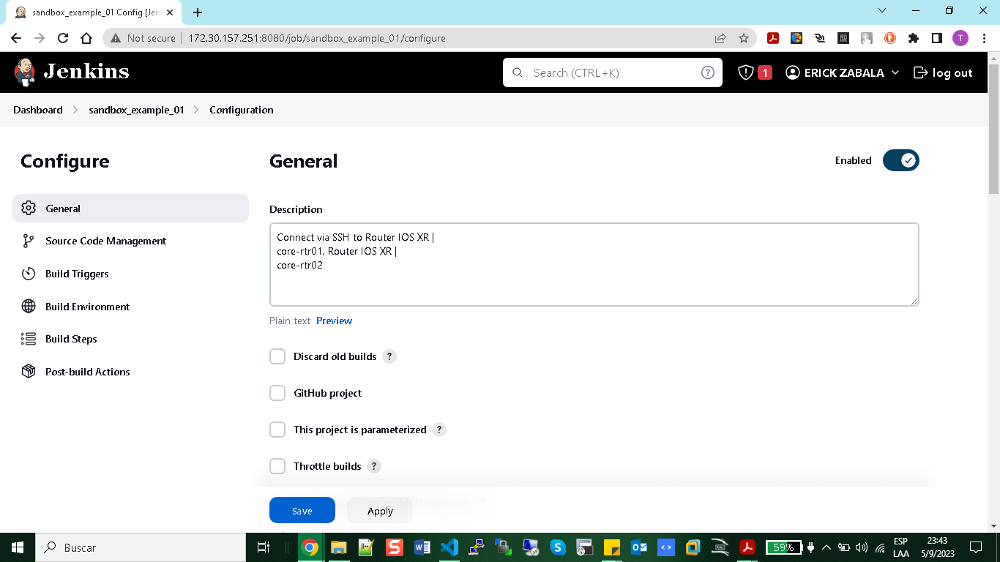

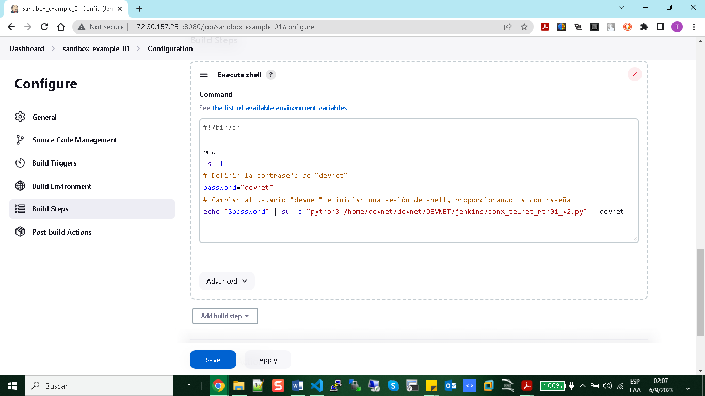

# Execute Python Script Jenkins


```bash

#!/bin/sh

pwd
ls -ll
# Definir la contraseña de "devnet"
password="devnet"
# Cambiar al usuario "devnet" e iniciar una sesión de shell, proporcionando la contraseña
echo "$password" | su -c "python3 /home/devnet/devnet/DEVNET/jenkins/conx_telnet_rtr01_v2.py" - devnet

```

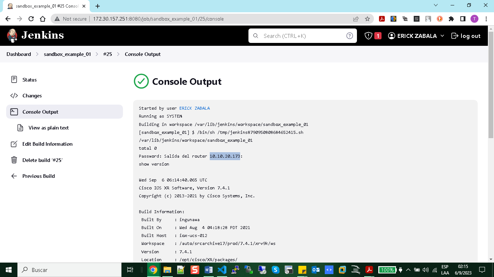

# Configure Trigger (CRON) Linux via Jenkins


# SMTP 

Set Google Account:

1. security
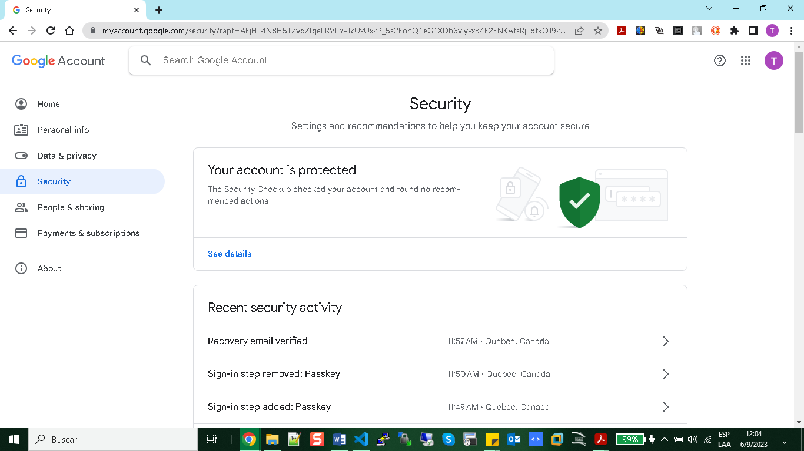
2. second step verification
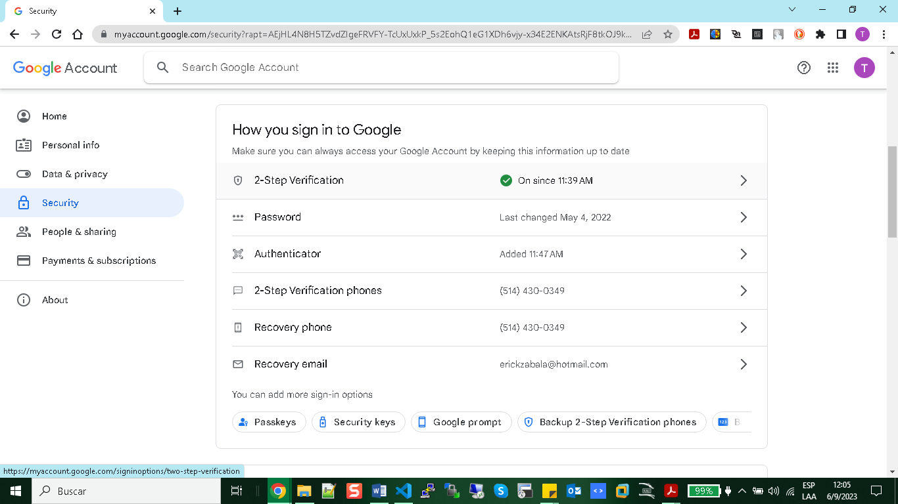
3. App passwords
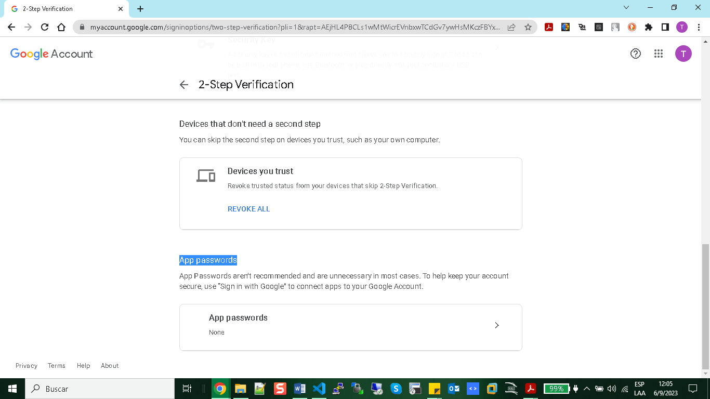
4. App Jenkins
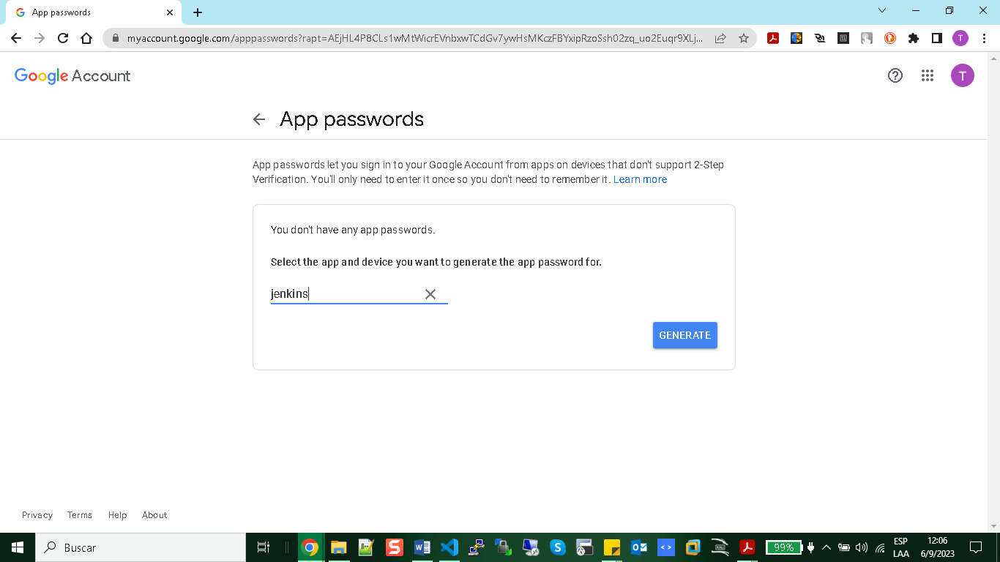
5. Account Generated
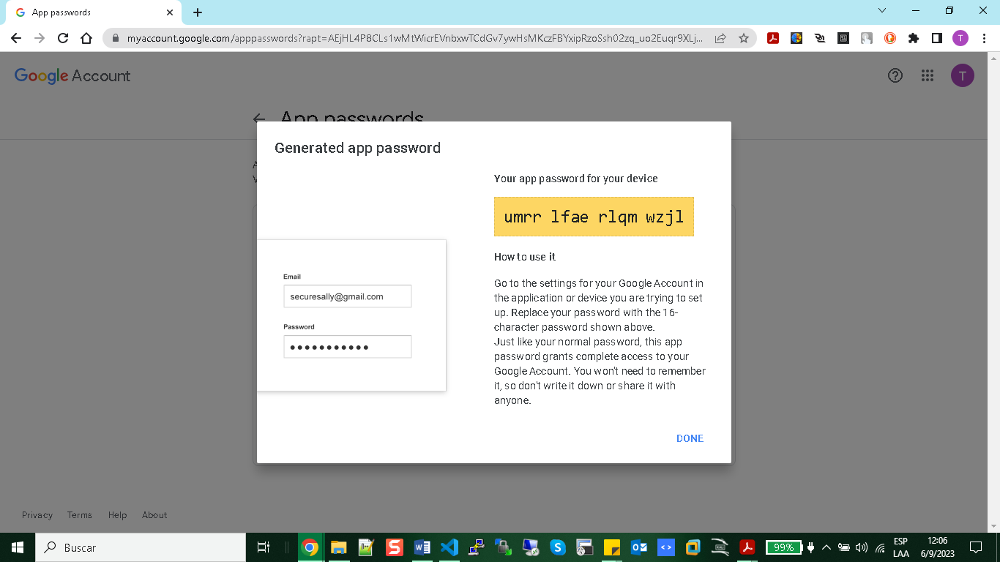

umrrlfaerlqmwzjl
Dashboard > Manage Jenkins > Configure System > E-mail Notification > Advanced Settings

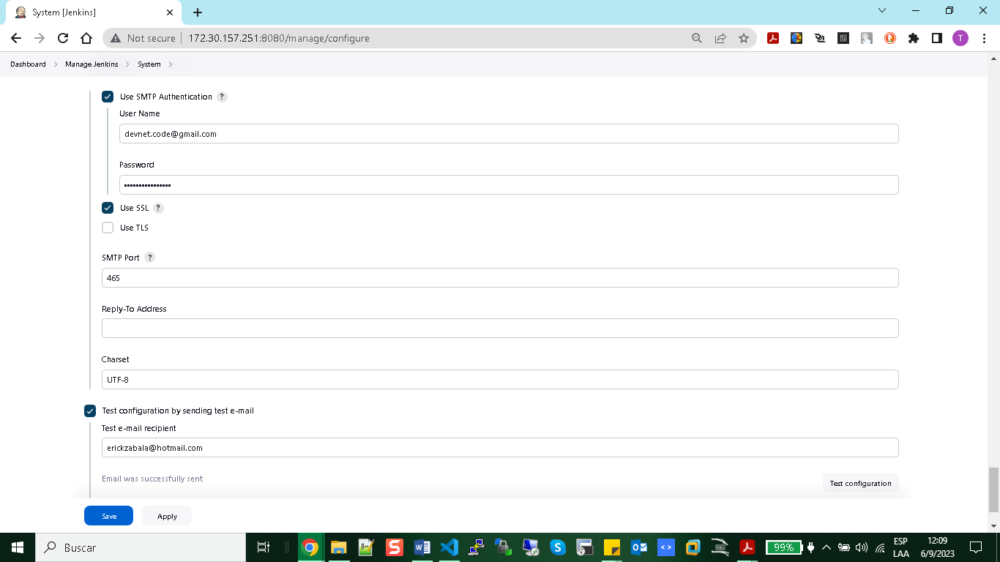

# Post Build Actions Jenkins

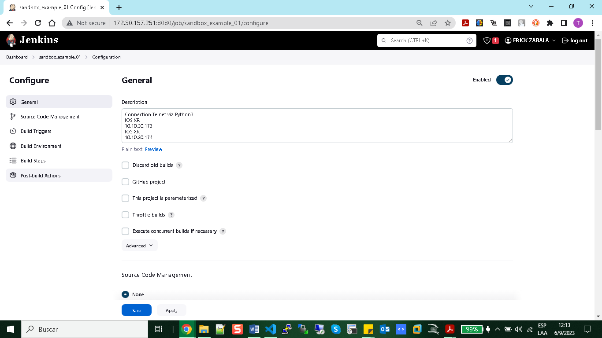

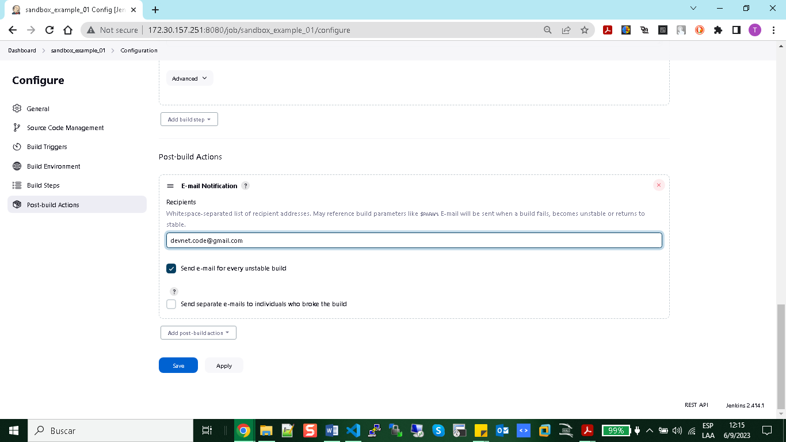

# PLUGINS

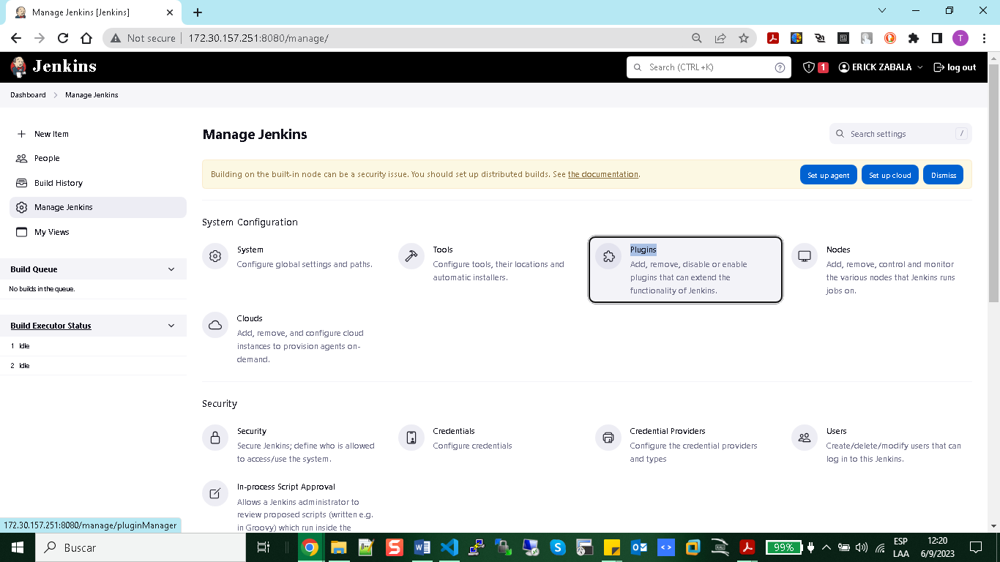

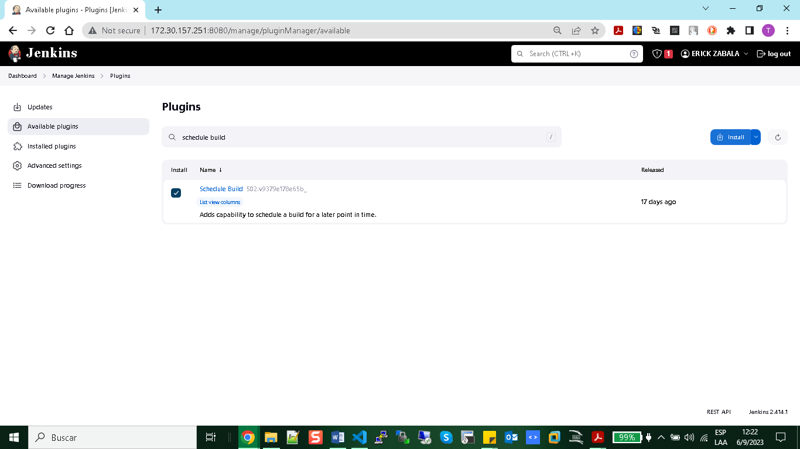

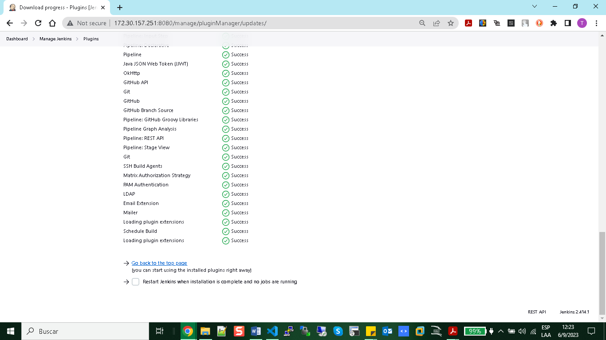

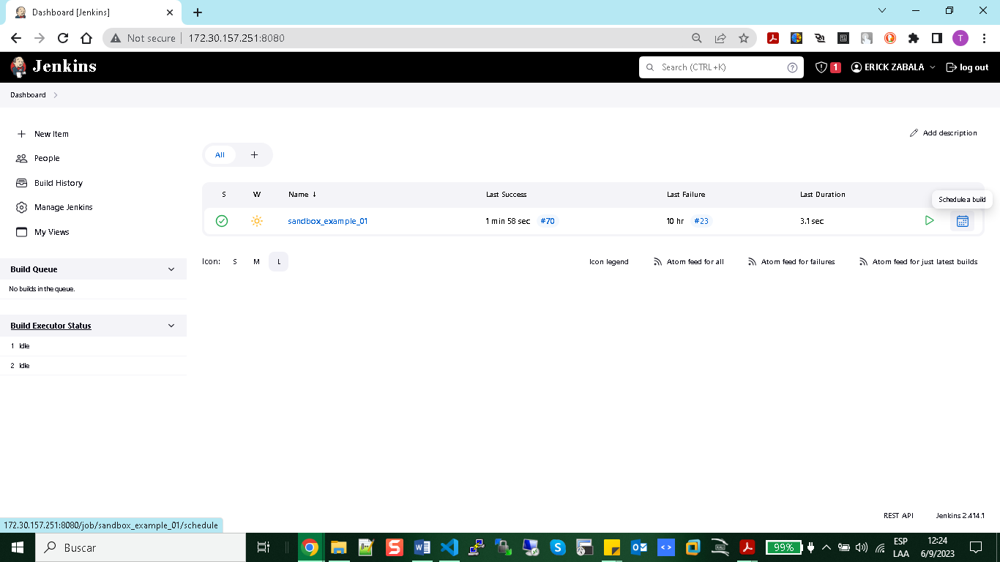

# GIT & Jenkins

run: ansible
$ ansible-playbook -i hosts playbook_02.yml

Then go to global configuration

Manage Configuration > Tools

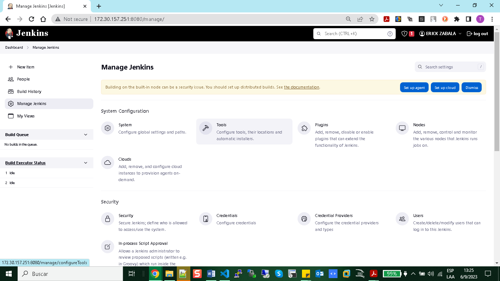

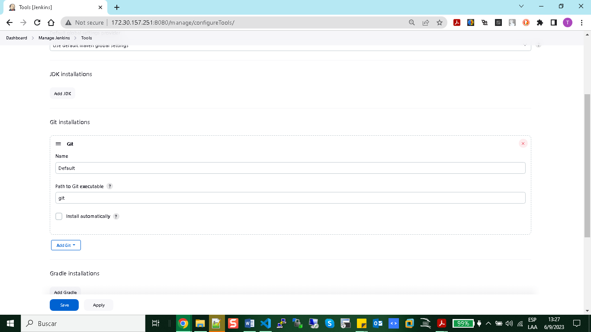

# Install NGROK

 curl -s https://ngrok-agent.s3.amazonaws.com/ngrok.asc | sudo tee /etc/apt/trusted.gpg.d/ngrok.asc >/dev/null && echo "deb https://ngrok-agent.s3.amazonaws.com buster main" | sudo tee /etc/apt/sources.list.d/ngrok.list && sudo apt update && sudo apt install ngrok

devnet@PC1 ~/devnet/DEVNET/jenkins $ ls
ansible                  credentials.txt  images                           routers.json
conx_telnet_rtr01.py     image-b1.png     ngrok-v3-stable-linux-amd64.tgz
conx_telnet_rtr01_v2.py  image-b.png      readme.md

devnet@PC1 ~/devnet/DEVNET/jenkins $ sudo tar xvzf ngrok-v3-stable-linux-amd64.tgz -C /usr/local/bin
[sudo] password for devnet: 
ngrok

devnet@PC1 ~/devnet/DEVNET/jenkins $ ngrok --version
ngrok version 3.3.4

ngrok config add-authtoken 2V28XJi5G3L03QvTG3b

ngrok http 8080

https://5e0f-192-226-134-67.ngrok-free.app


openssl pkcs8 -topk8 -inform PEM -outform PEM -in jenkins-linux-wsl.2023-09-06.private-key.pem -out converted-github-app.pem -nocrypt

386520
https://github.com/ERICK-ZABALA/Test.git

# Jenkins Python

$ pip install python-jenkins

devnet@PC1 ~/devnet/DEVNET/jenkins $ pip install python-jenkINS

Defaulting to user installation because normal site-packages is not writeable
DEPRECATION: Loading egg at /usr/local/lib/python3.11/dist-packages/scapy-2.5.0.dev150-py3.11.egg is deprecated. pip 23.3 will enforce this behaviour change. A possible replacement is to use pip for package installation..
Collecting python-jenkINS
  Obtaining dependency information for python-jenkINS from https://files.pythonhosted.org/packages/85/05/dcde544581c549ab60fdb9e3908201194b1fec7ac0e349fcebe1f18ad054/python_jenkins-1.8.1-py3-none-any.whl.metadata
  Downloading python_jenkins-1.8.1-py3-none-any.whl.metadata (3.8 kB)
Collecting multi-key-dict (from python-jenkINS)
  Downloading multi_key_dict-2.0.3.zip (9.9 kB)
  Preparing metadata (setup.py) ... done
Collecting pbr>=0.8.2 (from python-jenkINS)
  Downloading pbr-5.11.1-py2.py3-none-any.whl (112 kB)
     ━━━━━━━━━━━━━━━━━━━━━━━━━━━━━━━━━━━━━━━━ 112.7/112.7 kB 107.2 kB/s eta 0:00:00
Requirement already satisfied: requests in /usr/lib/python3/dist-packages (from python-jenkINS) (2.31.0)
Collecting setuptools<66 (from python-jenkINS)
  Downloading setuptools-65.7.0-py3-none-any.whl (1.2 MB)
     ━━━━━━━━━━━━━━━━━━━━━━━━━━━━━━━━━━━━━━━━ 1.2/1.2 MB 778.5 kB/s eta 0:00:00
Requirement already satisfied: six>=1.3.0 in /usr/lib/python3/dist-packages (from python-jenkINS) (1.16.0)
Downloading python_jenkins-1.8.1-py3-none-any.whl (27 kB)
Building wheels for collected packages: multi-key-dict
  Building wheel for multi-key-dict (setup.py) ... done
  Created wheel for multi-key-dict: filename=multi_key_dict-2.0.3-py3-none-any.whl size=9283 sha256=5393fe28b47b425cef8e54c7455ac59767562537331a8b0fb842d477719e749f
  Stored in directory: /home/devnet/.cache/pip/wheels/b7/86/6a/b0b1ffcbb5a919b6ce66d39a76e67dcbefb334e73d5e62e96a
Successfully built multi-key-dict
Installing collected packages: multi-key-dict, setuptools, pbr, python-jenkINS
  WARNING: The script pbr is installed in '/home/devnet/.local/bin' which is not on PATH.
  Consider adding this directory to PATH or, if you prefer to suppress this warning, use --no-warn-script-location.
Successfully installed multi-key-dict-2.0.3 pbr-5.11.1 python-jenkINS-1.8.1 setuptools-65.7.0

devnet@PC1 ~/devnet/DEVNET/jenkins $ python3
Python 3.11.4 (main, Jun  7 2023, 10:13:09) [GCC 12.2.0] on linux
Type "help", "copyright", "credits" or "license" for more information.

>>> import jenkins
>>> server = jenkins.Jenkins('http://172.30.157.251:8080/', username='admin', password='C1sc0123!')
>>> user = server.get_whoami()
>>> version = server.get_version()
>>> print('Hello %s from Jenkins %s' % (user['fullName'], version))
Hello ERICK ZABALA from Jenkins 2.414.1

>>> plugin = server.get_plugins_info()
>>> plugin
[{'active': True, 'backupVersion': None, 'bundled': False, 'deleted': False, 'dependencies': [{'optional': False, 'shortName': 'commons-lang3-api', 'version': '3.13.0-62.v7d18e55f51e2'}, {'optional': False, 'shortName': 'okhttp-api', 'version': '4.11.0-157.v6852a_a_fa_ec11'}, {'optional': False, 'shortName': 'instance-identity'}]

>>> job = server.get_job_config('sandbox_git_example_03')
>>> import pprint
>>> pprint.pprint(job)

("<?xml version='1.1' encoding='UTF-8'?>\n"
 '<project>\n'
 '  <actions/>\n'
 '  <description>Integration git jenkins ansible sandbox cisco</description>\n'
 '  <keepDependencies>false</keepDependencies>\n'
 '  <properties/>\n'
 '  <scm class="hudson.plugins.git.GitSCM" plugin="git@5.2.0">\n'
 '    <configVersion>2</configVersion>\n'
 '    <userRemoteConfigs>\n'
 '      <hudson.plugins.git.UserRemoteConfig>\n'
 '        <url>https://github.com/ERICK-ZABALA/Test.git</url>\n'
 '        <credentialsId>Git Hub Jenkins WSL Linux</credentialsId>\n'
 '      </hudson.plugins.git.UserRemoteConfig>\n'
 '    </userRemoteConfigs>\n'
 '    <branches>\n'
 '      <hudson.plugins.git.BranchSpec>\n'
 '        <name>*/main</name>\n'
 '      </hudson.plugins.git.BranchSpec>\n'
 '    </branches>\n'
 '    '
 '<doGenerateSubmoduleConfigurations>false</doGenerateSubmoduleConfigurations>\n'
 '    <submoduleCfg class="empty-list"/>\n'
 '    <extensions/>\n'
 '  </scm>\n'
 '  <canRoam>true</canRoam>\n'
 '  <disabled>false</disabled>\n'
 '  '
 '<blockBuildWhenDownstreamBuilding>false</blockBuildWhenDownstreamBuilding>\n'
 '  <blockBuildWhenUpstreamBuilding>false</blockBuildWhenUpstreamBuilding>\n'
 '  <triggers/>\n'
 '  <concurrentBuild>false</concurrentBuild>\n'
 '  <builders>\n'
 '    <hudson.tasks.Shell>\n'
 '      <command>ls\n'
 'pwd\n'
 'whoami\n'
 'ansible --version\n'
 'ansible-playbook -i hosts playbook_02.yml\n'
 'cat output/hostname_or_ip_1.json\n'
 'cat output/hostname_or_ip_1.json</command>\n'
 '      <configuredLocalRules/>\n'
 '    </hudson.tasks.Shell>\n'
 '  </builders>\n'
 '  <publishers/>\n'
 '  <buildWrappers/>\n'
 '</project>')
>>> exit()


open 443 linux

sudo apt-get install ufw
sudo ufw enable
sudo ufw allow 443/tcp
sudo ufw status
sudo ufw reload


+ Dar permisos sudo a usuario jenkins como root (no recomendado)

devnet@PC1 ~/devnet/DEVNET/jenkins $ sudo usermod -aG sudo jenkins
[sudo] password for devnet: 
devnet@PC1 ~/devnet/DEVNET/jenkins $ sudo -l -U jenkins
Matching Defaults entries for jenkins on PC1:
    env_reset, mail_badpass,
    secure_path=/usr/local/sbin\:/usr/local/bin\:/usr/sbin\:/usr/bin\:/sbin\:/bin, use_pty

User jenkins may run the following commands on PC1:
    (ALL : ALL) ALL
devnet@PC1 ~/devnet/DEVNET/jenkins $ id jenkins
uid=102(jenkins) gid=113(jenkins) groups=113(jenkins),27(sudo)

$ sudo vi /etc/sudoers

Add:
jenkins ALL=NOPASSWD:/path of script/