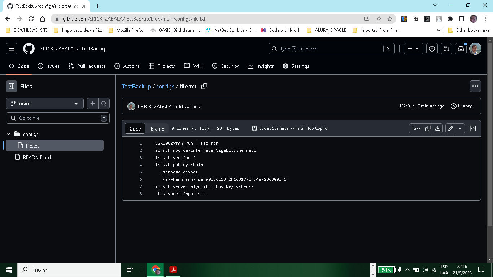

# GIT

+ GitHub = Centrilized Hosting Service - CHS
+ Git = Revision Control System - RCS

Git is usefull: 

**Summary of Git's Key Features:**

- **Distributed Development:** Git facilitates parallel and independent development in private repositories, allowing for offline work. It offers flexibility not found in centralized version control systems.

- **Scalability:** Git seamlessly accommodates thousands of developers, ensuring the smooth integration of their contributions, making it suitable for large-scale projects.

- **Performance:** Prioritizing speed and efficiency, Git employs compression and delta checks to optimize data storage and transfer. This speed is crucial for projects like the Linux kernel.

- **Accountability and Immutability:** Git enforces a change log for every file modification, maintaining a clear history and reasons for changes. Data objects in Git remain immutable, enhancing accountability.

- **Atomic Transactions:** Git guarantees the integrity of repositories by ensuring related changes occur entirely or not at all, preventing incomplete or corrupted states.

- **Complete Repositories:** Each Git repository contains a comprehensive archive of all historical file revisions, preserving the project's entire version history.

- **Free and Open-Source:** Git's origins are rooted in the principles of free and open-source software, maintaining a liberal usage license that aligns with these values.

These features make Git a powerful and flexible version control system for developers and teams of all sizes.

# Install GIT
```bash
$ sudo apt update
$ sudo apt install -y git
& git --version
```

+ Verify Config Set:

```bash
$ git config --list
```

```bash
Output:

filter.lfs.clean=git-lfs clean -- %f
filter.lfs.smudge=git-lfs smudge -- %f
filter.lfs.process=git-lfs filter-process
filter.lfs.required=true
credential.helper=/.codespaces/bin/gitcredential_github.sh
user.name=name = ER!CK;
user.email=38144008+ERICK-ZABALA@users.noreply.github.com
gpg.program=/.codespaces/bin/gh-gpgsign
init.defaultbranch=main

```

+ Set Username and Email:

```bash
$ git config --global user.name "ER!CK;"
```

```bash
$ git config --global user.email "erickzabala@hotmail.com"

```

# GITIGNORE
 
 That feature is useful to avoid upload files with sensitive information, ex API Keys, passwords, etc.

File: .gitignore

 ```bash
 # Byte-compiled / optimized / DLL files
pycache /
*.py[cod]
*$py.class
# OSX
# =========================
.DS_Store
.AppleDouble
.LSOverride
 ```
# GIT ADD & Commit:

```bash
$ git add .
$ git add myFile.txt
$ git commit -m "updated: Add myFile.txt"

```

# GIT LOG

Permit verify all commit and added file to your repository in order from new commits to old commits.

```bash
$ git log
```

Output:

```bash
commit 4473bea6bb05cec9c50f756a4b5332ceef53c1c1 (HEAD -> main)
Author: name = ER!CK <38144008+ERICK-ZABALA@users.noreply.github.com>
Date:   Thu Sep 21 05:11:59 2023 +0000

    updated: file gitignore

commit 74b0c115a600bfffcf9edc20ad26617260641fb3 (origin/main, origin/HEAD)
Author: name = ER!CK <38144008+ERICK-ZABALA@users.noreply.github.com>
Date:   Thu Sep 21 04:44:42 2023 +0000
:...skipping...
commit 4473bea6bb05cec9c50f756a4b5332ceef53c1c1 (HEAD -> main)
Author: name = ER!CK <38144008+ERICK-ZABALA@users.noreply.github.com>
Date:   Thu Sep 21 05:11:59 2023 +0000

    updated: file gitignore

commit 74b0c115a600bfffcf9edc20ad26617260641fb3 (origin/main, origin/HEAD)
Author: name = ER!CK <38144008+ERICK-ZABALA@users.noreply.github.com>
Date:   Thu Sep 21 04:44:42 2023 +0000

    updated: github

commit a1e59790ca14a6045c606aeffa08a7ea9c438436
Author: name = ER!CK <38144008+ERICK-ZABALA@users.noreply.github.com>
Date:   Wed Sep 20 03:40:43 2023 +0000

    updated docker

```

+ More information using Git ID: 

```bash
$ git show 4473bea6bb05cec9c50f756a4b5332ceef53c1c1
```

Output:

```bash
commit 4473bea6bb05cec9c50f756a4b5332ceef53c1c1 (HEAD -> main)
Author: name = ER!CK <38144008+ERICK-ZABALA@users.noreply.github.com>
Date:   Thu Sep 21 05:11:59 2023 +0000

    updated: file gitignore

diff --git a/.gitignore b/.gitignore
new file mode 100644
index 00000000..7c1a581f
```

# GIT REVERT

To revert changes, verify that you do not have any commit on queue using git status.

```bash
git revert 3bb043fbb1f5d279d6d6f7748e41920dba9e2f93
```

Output:

```bash
Auto-merging network/github/Readme.md
[main 075a97df] Revert "updated: file gitignore"
 1 file changed, 7 insertions(+), 2 deletions(-)

```
# GIT RESET

Permit eliminate sequence of changes of one times.

```bash
git reset --hard 74b0c115a600bfffcf9edc20ad26617260641fb3
```
Output: 

```bash
HEAD is now at 74b0c115 updated: github
```

# GIT Branch

Permit create different branches in the same repository then you merge your branch with your master branch then.

```bash
git branch developer

git branch
  developer
* main

git checkout developer
M       network/github/Readme.md
Switched to branch 'developer'

git branch
* developer
  main

```

# GIT PULL

```bash
git remote add gitHubRepo https://github.com/ERICK-ZABALA/DEVNET.git
git remote -v

origin  https://github.com/ERICK-ZABALA/DEVNET (fetch)
origin  https://github.com/ERICK-ZABALA/DEVNET (push)

git pull https://github.com/ERICK-ZABALA/DEVNET main

From https://github.com/ERICK-ZABALA/DEVNET
 * branch              main       -> FETCH_HEAD
Already up to date.

git push https://github.com/ERICK-ZABALA/DEVNET main

Everything up-to-date

```

# GIT CLONE
```bash
git clone https://github.com/ERICK-ZABALA/DEVNET.git
```

# FORK

When you make a fork from particular project and you make some changes.

Pull Request: we should fill in as much information as possible to
provide justifications for making the change.

# GIT with Python

```bash
pip install gitpython
```

```python
$ python3
Python 3.10.8 (main, Sep 13 2023, 16:52:46) [GCC 9.4.0] on linux
Type "help", "copyright", "credits" or "license" for more information.
>>> from git import Repo
>>> repo = Repo('/workspaces/DEVNET')
>>> for commits in list(repo.iter_commits('main')):
...     print(commits)
... 
3880083a277434f1ebe784b0e370b1d57670a3b3
e27ab7f27d23720324943bbec2377f2472755bba
1eb469afeddb407a3114b079fe71c6c2ffb0967e
89dbc9bbbc6e12afae59a5f6f76f357084f57514

>>> for (path, stage), entry in repo.index.entries.items():
... print(path, stage, entry)
...
myFile.txt 0 100644 69e7d4728965c885180315c0d4c206637b3f6bad 0 myFile.txt
```

# PyGitHub

```bash
$ pip install PyGithub
```
```python

Python 3.10.8 (main, Sep 13 2023, 16:52:46) [GCC 9.4.0] on linux
Type "help", "copyright", "credits" or "license" for more information.
>>> from github import Github
>>> g = Github("ghp_Is")
>>> for repo in g.get_user().get_repos():
...     print(repo)
... 
Repository(full_name="c.../38144008")
Repository(full_name="E.../01_Webex_Connect_SMS")
Repository(full_name="E.../02_Webex_Connect_VideoCall")
>>> exit()

```
# Automating Configuration Backup

This code permit copy your files to your github using add and commit.

```python
#!/usr/bin/env python3
# reference: https://stackoverflow.com/questions/38594717/how-do-ipush-new-files-to-github
from github import Github, InputGitTreeElement
import os

github_token = 'ghp_...'
configs_dir = 'configs'
github_repo = 'TestBackup'

# Retrieve the list of files in configs directory
file_list = []
for dirpath, dirname, filenames in os.walk(configs_dir):
    for f in filenames:
        file_list.append(configs_dir + "/" + f)

g = Github(github_token)
repo = g.get_user().get_repo(github_repo)

commit_message = 'add configs'
master_ref = repo.get_git_ref('heads/main')
master_sha = master_ref.object.sha
base_tree = repo.get_git_tree(master_sha)
element_list = list()

for entry in file_list:
    with open(entry, 'r') as input_file:
        data = input_file.read()
    element = InputGitTreeElement(entry, '100644', 'blob', data)
    element_list.append(element)

# Create tree and commit
tree = repo.create_git_tree(element_list, base_tree)
parent = repo.get_git_commit(master_sha)
commit = repo.create_git_commit(commit_message, tree, [parent])
master_ref.edit(commit.sha)

```

