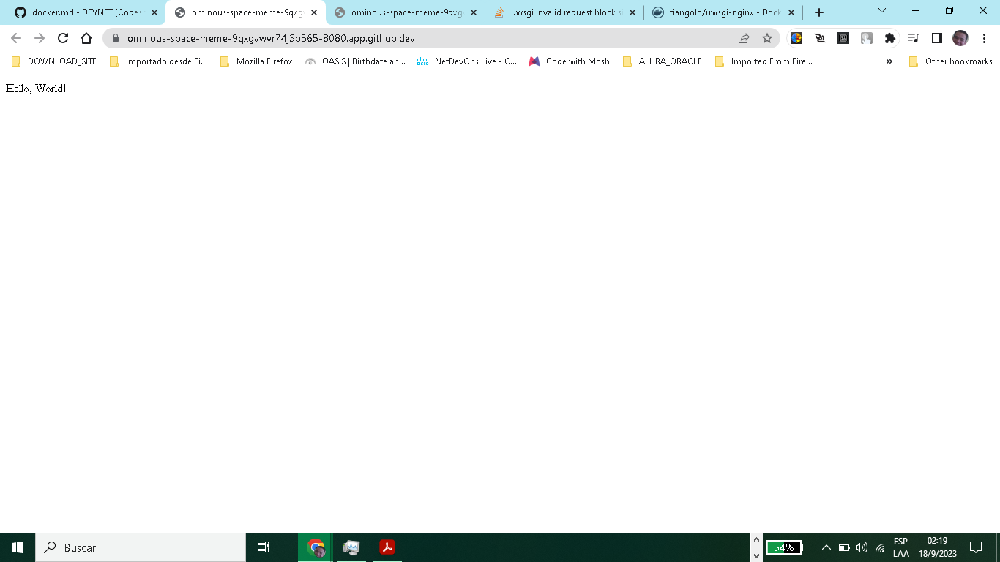

# Comandos Docker

+ Generate request GET
curl -i http://172.17.0.1:8080/

+ Build Container via docker-compose
docker-compose build

+ Activate Container

docker-compose up

+ Eliminate Container

docker-compose down --rmi all

+ Conatiner activos

docker-compose ps

+ Firewall Codespace

sudo iptables -L

Output:
Chain INPUT (policy ACCEPT)
target     prot opt source               destination         

Chain FORWARD (policy DROP)
target     prot opt source               destination         
DOCKER-USER  all  --  anywhere             anywhere            
DOCKER-ISOLATION-STAGE-1  all  --  anywhere             anywhere            
ACCEPT     all  --  anywhere             anywhere             ctstate RELATED,ESTABLISHED
DOCKER     all  --  anywhere             anywhere            
ACCEPT     all  --  anywhere             anywhere            
ACCEPT     all  --  anywhere             anywhere            
ACCEPT     all  --  anywhere             anywhere             ctstate RELATED,ESTABLISHED
DOCKER     all  --  anywhere             anywhere            
ACCEPT     all  --  anywhere             anywhere            
ACCEPT     all  --  anywhere             anywhere            
ACCEPT     tcp  --  172.16.5.0/24        anywhere             tcp dpt:4000
ACCEPT     tcp  --  172.16.5.0/24        anywhere             tcp dpt:5000
ACCEPT     tcp  --  anywhere             anywhere             tcp dpt:5000
ACCEPT     tcp  --  anywhere             anywhere             tcp dpt:5000
ACCEPT     tcp  --  anywhere             anywhere             tcp dpt:5000
ACCEPT     tcp  --  anywhere             anywhere             tcp dpt:http-alt
ACCEPT     tcp  --  anywhere             anywhere             tcp dpt:http-alt

Chain OUTPUT (policy ACCEPT)
target     prot opt source               destination         

Chain DOCKER (2 references)
target     prot opt source               destination         
ACCEPT     tcp  --  anywhere             172.28.0.2           tcp dpt:5000

Chain DOCKER-ISOLATION-STAGE-1 (1 references)
target     prot opt source               destination         
DOCKER-ISOLATION-STAGE-2  all  --  anywhere             anywhere            
DOCKER-ISOLATION-STAGE-2  all  --  anywhere             anywhere            
RETURN     all  --  anywhere             anywhere            

Chain DOCKER-ISOLATION-STAGE-2 (2 references)
target     prot opt source               destination         
DROP       all  --  anywhere             anywhere            
DROP       all  --  anywhere             anywhere            
RETURN     all  --  anywhere             anywhere            

Chain DOCKER-USER (1 references)
target     prot opt source               destination         
RETURN     all  --  anywhere             anywhere            

