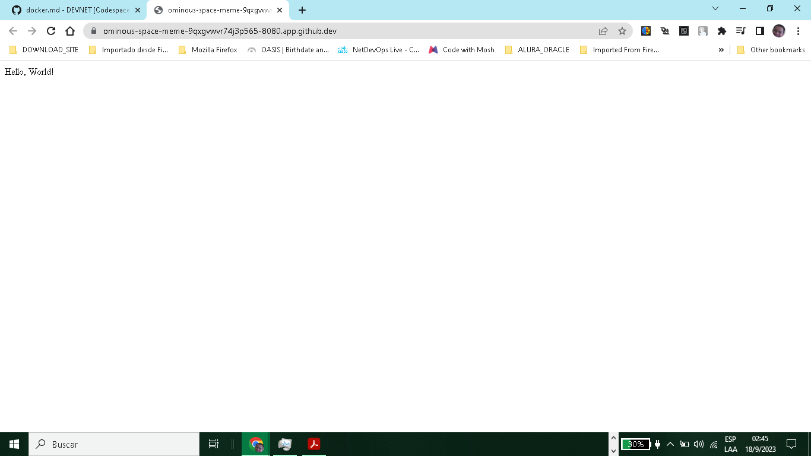
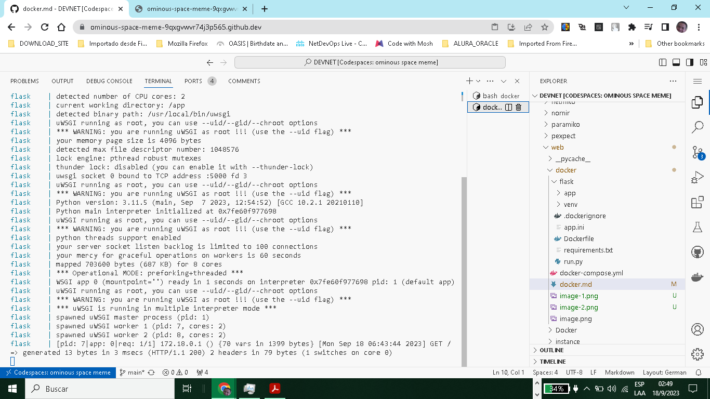
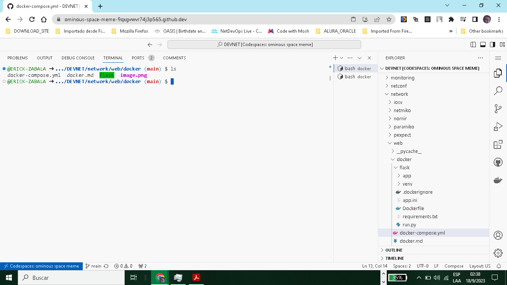

# Docker - Running Flask with Codespaces

+ Server Running as a Container

Port: 8080
https://ominous-space-meme-9qxgvwvr74j3p565-8080.app.github.dev/





# Configuration Files

+ docker-compose.yml

```yaml
version: "3.7"

services:

  flask:
    build: ./flask
    container_name: flask
    restart: always
    environment:
      - APP_NAME=MyFlaskApp
      - DB_USERNAME=example
    ports:
      - "8080:5000"

```
File: Dockerfile

```yaml
FROM tiangolo/uwsgi-nginx:python3.11
WORKDIR /app
ADD . /app
# Install Python dependencies
RUN pip install -r requirements.txt
# Upgrade pip
RUN pip install --upgrade pip
# Install the latest version of uWSGI
RUN pip install uwsgi
CMD ["uwsgi", "app.ini"]

```
File: app.ini

```bash
[uwsgi]
wsgi-file = run.py
callable = app
socket = :5000
processes = 4
threads = 2
master = true
chmod-socket = 660
vacuum = true
die-on-term = true
buffer-size = 32768 
protocol = http

```



# Comannds Docker

+ Generate request GET

```bash 
curl -i http://172.17.0.1:8080/
```

+ Build Container via docker-compose

```bash
docker-compose build
```
+ Activate Container

```bash
docker-compose up
```

+ Stop Container

```bash
docker-compose stop
```


+ Eliminate Container

```bash
docker-compose down --rmi all
```
+ Conatiner activos

```bash
docker-compose ps
```
+ Firewall Codespace

```bash
sudo iptables -L
```

Output: (No se abre ningun puerto en el Firewall)

```bash
Chain INPUT (policy ACCEPT)
target     prot opt source               destination         

Chain FORWARD (policy DROP)
target     prot opt source               destination         
DOCKER-USER  all  --  anywhere             anywhere            
DOCKER-ISOLATION-STAGE-1  all  --  anywhere             anywhere            
ACCEPT     all  --  anywhere             anywhere             ctstate RELATED,ESTABLISHED
DOCKER     all  --  anywhere             anywhere            
ACCEPT     all  --  anywhere             anywhere            
ACCEPT     all  --  anywhere             anywhere            

Chain OUTPUT (policy ACCEPT)
target     prot opt source               destination         

Chain DOCKER (1 references)
target     prot opt source               destination         

Chain DOCKER-ISOLATION-STAGE-1 (1 references)
target     prot opt source               destination         
DOCKER-ISOLATION-STAGE-2  all  --  anywhere             anywhere            
RETURN     all  --  anywhere             anywhere            

Chain DOCKER-ISOLATION-STAGE-2 (1 references)
target     prot opt source               destination         
DROP       all  --  anywhere             anywhere            
RETURN     all  --  anywhere             anywhere            

Chain DOCKER-USER (1 references)
target     prot opt source               destination         
RETURN     all  --  anywhere             anywhere            

```


