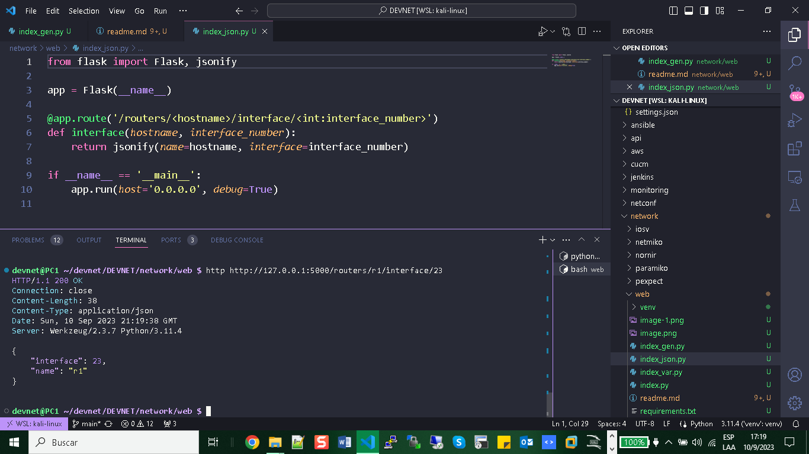
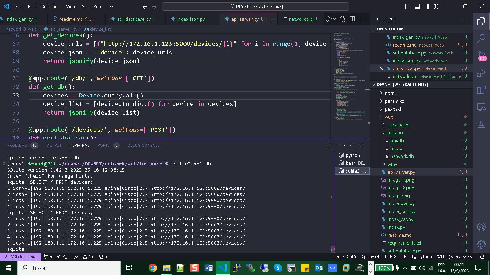

# WEB Server HTTP

+ Index.py

```python

from flask import Flask

app = Flask(__name__)

@app.route('/')
def index():
    return 'You are at index()'

@app.route('/routers/')
def routers():
    return 'You are at routers()'

if __name__ == '__main__':

    app.run(host='0.0.0.0', debug=True)
    
```

# HTTP Client

+ Install httpie to send request as a client via linux

``` bash
sudo pip install --upgrade pip setuptools
sudo pip install --upgrade httpie
```
# Test

```bash
$ http GET https://httpbin.org/user-agent
```
+ Output:

```bash
HTTP/1.1 200 OK
Access-Control-Allow-Credentials: true
Access-Control-Allow-Origin: *
Connection: keep-alive
Content-Length: 35
Content-Type: application/json
Date: Sun, 10 Sep 2023 20:28:22 GMT
Server: gunicorn/19.9.0

{
    "user-agent": "HTTPie/3.2.2"
}

```

+ http POST https://httpbin.org/post name=eric twitter=at_ericchou married:=true

# URL Variable


# URL Generation

``` python
from flask import Flask, url_for

app = Flask(__name__)

@app.route('/')
def index():
    return 'You are at index()'

@app.route('/routers/<hostname>')
def routers(hostname):
    return 'You are at %s' % hostname

@app.route('/routers/<hostname>/interface/<int:interface_number>')
def interface(hostname, interface_number):
    return 'You are at %s interface %d' % (hostname, interface_number)

@app.route('/cisco/<hostname>/list_interfaces')
def devices(hostname):
    if hostname in routers:
        return 'Listing iterfaces for %s' % hostname
    else:
        return 'invalid hostname'
routers = ['r1', 'r2', 'r3']
for router in routers:
    with app.test_request_context ():
        print(url_for('devices', hostname=router))

if __name__ == '__main__':
    app.run(host='0.0.0.0', debug=True)
    
```


# JSONIFY Return



```python
from flask import Flask, jsonify

app = Flask(__name__)

@app.route('/routers/<hostname>/interface/<int:interface_number>')
def interface(hostname, interface_number):
    return jsonify(name=hostname, interface=interface_number)

if __name__ == '__main__':
    app.run(host='0.0.0.0', debug=True)
    
```

# SQL DATA BASE


```python

from flask import Flask
from flask_sqlalchemy import SQLAlchemy

# Create Flask application, load configuration, and create
# the SQLAlchemy object
app = Flask(__name__)
app.config['SQLALCHEMY_DATABASE_URI'] = 'sqlite:///network.db'
db = SQLAlchemy(app)

# This is the database model object


class Device(db.Model):
    __tablename__ = 'devices'
    id = db.Column(db.Integer, primary_key=True)
    hostname = db.Column(db.String(120), index=True)
    vendor = db.Column(db.String(40))

    def __init__(self, hostname, vendor):
        self.hostname = hostname
        self.vendor = vendor

    def __repr__(self):
        return '<Device %r>' % self.hostname


if __name__ == '__main__':
    with app.app_context():
        db.create_all()  # Crea las tablas en la base de datos si no existen
        r1 = Device('lax-dc1-core1', 'Juniper')
        r2 = Device('sfo-dc1-core1', 'Cisco')
        db.session.add(r1)
        db.session.add(r2)
        db.session.commit()
        
```

+ Install sqlite3

sudo apt-get install sqlite3



sqlite3 api.db
Output:
SQLite version 3.42.0 2023-05-16 12:36:15
Enter ".help" for usage hints.
sqlite> SELECT * FROM devices;
1|iosv-1|192.168.1.1|172.16.1.225|spine|Cisco|2.7|http://172.16.1.123:5000/devices/
2|iosv-1|192.168.1.1|172.16.1.225|spine|Cisco|2.7|http://172.16.1.123:5000/devices/
3|iosv-1|192.168.1.1|172.16.1.225|spine|Cisco|2.7|http://172.16.1.123:5000/devices/
4|iosv-1|192.168.1.1|172.16.1.225|spine|Cisco|2.7|http://172.16.1.123:5000/devices/
sqlite> SELECT * FROM devices;
1|iosv-1|192.168.1.1|172.16.1.225|spine|Cisco|2.7|http://172.16.1.123:5000/devices/
2|iosv-1|192.168.1.1|172.16.1.225|spine|Cisco|2.7|http://172.16.1.123:5000/devices/
3|iosv-1|192.168.1.1|172.16.1.225|spine|Cisco|2.7|http://172.16.1.123:5000/devices/
4|iosv-1|192.168.1.1|172.16.1.225|spine|Cisco|2.7|http://172.16.1.123:5000/devices/
5|iosv-1|192.168.1.1|172.16.1.225|spine|Cisco|2.5|http://172.16.1.123:5000/devices/
sqlite> .exit

+ http GET http://172.30.157.251:5000/db/

Output: 

``` bash
HTTP/1.1 200 OK
Connection: close
Content-Length: 1118
Content-Type: application/json
Date: Wed, 13 Sep 2023 04:10:47 GMT
Server: Werkzeug/2.3.7 Python/3.11.4

[
    {
        "hostname": "iosv-1",
        "id": 1,
        "loopback": "192.168.1.1",
        "mgmt_ip": "172.16.1.225",
        "os": "2.7",
        "role": "spine",
        "self_url": "http://172.16.1.123:5000/devices/",
        "vendor": "Cisco"
    },
    {
        "hostname": "iosv-1",
        "id": 2,
        "loopback": "192.168.1.1",
        "mgmt_ip": "172.16.1.225",
        "os": "2.7",
        "role": "spine",
        "self_url": "http://172.16.1.123:5000/devices/",
        "vendor": "Cisco"
    },
    {
        "hostname": "iosv-1",
        "id": 3,
        "loopback": "192.168.1.1",
        "mgmt_ip": "172.16.1.225",
        "os": "2.7",
        "role": "spine",
        "self_url": "http://172.16.1.123:5000/devices/",
        "vendor": "Cisco"
    },
    {
        "hostname": "iosv-1",
        "id": 4,
        "loopback": "192.168.1.1",
        "mgmt_ip": "172.16.1.225",
        "os": "2.7",
        "role": "spine",
        "self_url": "http://172.16.1.123:5000/devices/",
        "vendor": "Cisco"
    },
    {
        "hostname": "iosv-1",
        "id": 5,
        "loopback": "192.168.1.1",
        "mgmt_ip": "172.16.1.225",
        "os": "2.5",
        "role": "spine",
        "self_url": "http://172.16.1.123:5000/devices/",
        "vendor": "Cisco"
    }
]

```
