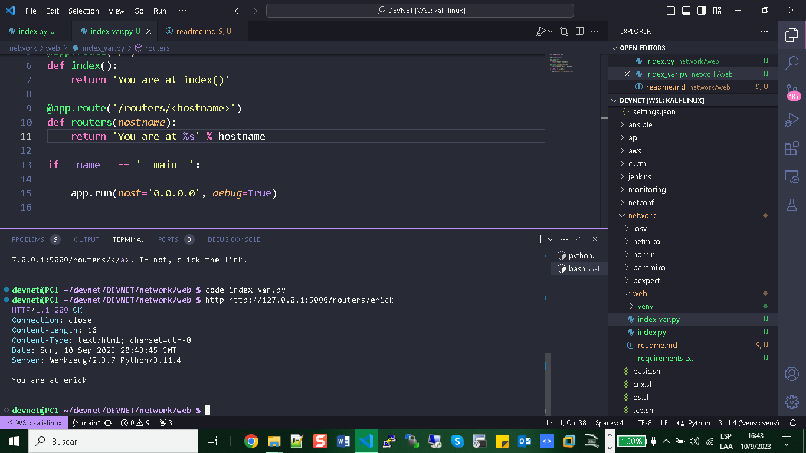
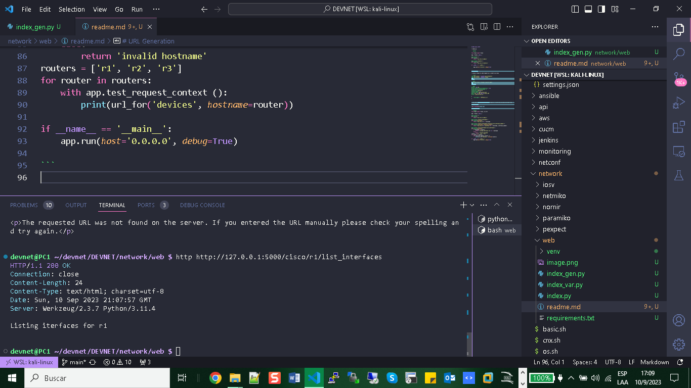

# WEB Server HTTP

Start a server HTTP using Flask framework over Python Language. 

+ Default Port 5000


+ File: Index.py

```python

from flask import Flask

app = Flask(__name__)

@app.route('/')
def index():
    return 'You are at index()'

@app.route('/routers/')
def routers():
    return 'You are at routers()'

if __name__ == '__main__':

    app.run(host='0.0.0.0', debug=True)
    
```

# HTTP Client

+ Install httpie to send request as a client via linux

``` bash
sudo pip install --upgrade pip setuptools
sudo pip install --upgrade httpie
```
# Test

```bash
$ http GET https://httpbin.org/user-agent
```
+ Output:

```bash
HTTP/1.1 200 OK
Access-Control-Allow-Credentials: true
Access-Control-Allow-Origin: *
Connection: keep-alive
Content-Length: 35
Content-Type: application/json
Date: Sun, 10 Sep 2023 20:28:22 GMT
Server: gunicorn/19.9.0

{
    "user-agent": "HTTPie/3.2.2"
}

```
In order to test owner client HTTP you can send a request to this link:

+ http POST https://httpbin.org/post name=eric twitter=at_ericchou married:=true

# URL Variable
Permit assign a variable in the link http how you see in the image:



# URL Generation
You can insert variable and the form dynamic create a render, really usefull to generate scalable links.

``` python
from flask import Flask, url_for

app = Flask(__name__)

@app.route('/')
def index():
    return 'You are at index()'

@app.route('/routers/<hostname>')
def routers(hostname):
    return 'You are at %s' % hostname

@app.route('/routers/<hostname>/interface/<int:interface_number>')
def interface(hostname, interface_number):
    return 'You are at %s interface %d' % (hostname, interface_number)

@app.route('/cisco/<hostname>/list_interfaces')
def devices(hostname):
    if hostname in routers:
        return 'Listing iterfaces for %s' % hostname
    else:
        return 'invalid hostname'
routers = ['r1', 'r2', 'r3']
for router in routers:
    with app.test_request_context ():
        print(url_for('devices', hostname=router))

if __name__ == '__main__':
    app.run(host='0.0.0.0', debug=True)
    
```



# JSONIFY Return

NOTE:

+ Serializar a JSON
json_data = json.dumps(data)

+ Deserializar desde JSON ---> Data Dict is transformed from JSON data
data = json.loads(json_data)

(JSONIFY) convert from Dict to --> Object JSON as a response HTTP 


```python
from flask import Flask, jsonify

app = Flask(__name__)

@app.route('/routers/<hostname>/interface/<int:interface_number>')
def interface(hostname, interface_number):
    return jsonify(name=hostname, interface=interface_number)

if __name__ == '__main__':
    app.run(host='0.0.0.0', debug=True)
    
```

# SQL DATA BASE - Connection

This code show how to integrate your SQL DB in Flask to maintain register all the requests.

```python

from flask import Flask
from flask_sqlalchemy import SQLAlchemy

# Create Flask application, load configuration, and create
# the SQLAlchemy object
app = Flask(__name__)
app.config['SQLALCHEMY_DATABASE_URI'] = 'sqlite:///network.db'
db = SQLAlchemy(app)

# This is the database model object


class Device(db.Model):
    __tablename__ = 'devices'
    id = db.Column(db.Integer, primary_key=True)
    hostname = db.Column(db.String(120), index=True)
    vendor = db.Column(db.String(40))

    def __init__(self, hostname, vendor):
        self.hostname = hostname
        self.vendor = vendor

    def __repr__(self):
        return '<Device %r>' % self.hostname


if __name__ == '__main__':
    with app.app_context():
        db.create_all()  # Crea las tablas en la base de datos si no existen
        r1 = Device('lax-dc1-core1', 'Juniper')
        r2 = Device('sfo-dc1-core1', 'Cisco')
        db.session.add(r1)
        db.session.add(r2)
        db.session.commit()
        
```

+ Install SQLite3

```bash
sudo apt-get install sqlite3
```


```bash
sqlite3 api.db
```

+ Output:

SQLite version 3.42.0 2023-05-16 12:36:15
Enter ".help" for usage hints.

```bash
sqlite> SELECT * FROM devices;
```

```bash
1|iosv-1|192.168.1.1|172.16.1.225|spine|Cisco|2.7|http://172.16.1.123:5000/devices/
2|iosv-1|192.168.1.1|172.16.1.225|spine|Cisco|2.7|http://172.16.1.123:5000/devices/
3|iosv-1|192.168.1.1|172.16.1.225|spine|Cisco|2.7|http://172.16.1.123:5000/devices/
4|iosv-1|192.168.1.1|172.16.1.225|spine|Cisco|2.7|http://172.16.1.123:5000/devices/
```

```bash
sqlite> SELECT * FROM devices;
1|iosv-1|192.168.1.1|172.16.1.225|spine|Cisco|2.7|http://172.16.1.123:5000/devices/
2|iosv-1|192.168.1.1|172.16.1.225|spine|Cisco|2.7|http://172.16.1.123:5000/devices/
3|iosv-1|192.168.1.1|172.16.1.225|spine|Cisco|2.7|http://172.16.1.123:5000/devices/
4|iosv-1|192.168.1.1|172.16.1.225|spine|Cisco|2.7|http://172.16.1.123:5000/devices/
5|iosv-1|192.168.1.1|172.16.1.225|spine|Cisco|2.5|http://172.16.1.123:5000/devices/
```

```bash
sqlite> .tables
```

```bash
devices
```

```bash
sqlite> .schema devices
CREATE TABLE devices (
        id INTEGER NOT NULL, 
        hostname VARCHAR(120), 
        loopback VARCHAR(40), 
        mgmt_ip VARCHAR(40), 
        role VARCHAR(40), 
        vendor VARCHAR(40), 
        os VARCHAR(40), 
        PRIMARY KEY (id)
);
CREATE INDEX ix_devices_hostname ON devices (hostname);
```

sqlite> .exit

+ http GET http://172.30.157.251:5000/db/

Output: 

``` bash
HTTP/1.1 200 OK
Connection: close
Content-Length: 1118
Content-Type: application/json
Date: Wed, 13 Sep 2023 04:10:47 GMT
Server: Werkzeug/2.3.7 Python/3.11.4

[
    {
        "hostname": "iosv-1",
        "id": 1,
        "loopback": "192.168.1.1",
        "mgmt_ip": "172.16.1.225",
        "os": "2.7",
        "role": "spine",
        "self_url": "http://172.16.1.123:5000/devices/",
        "vendor": "Cisco"
    },
    {
        "hostname": "iosv-1",
        "id": 2,
        "loopback": "192.168.1.1",
        "mgmt_ip": "172.16.1.225",
        "os": "2.7",
        "role": "spine",
        "self_url": "http://172.16.1.123:5000/devices/",
        "vendor": "Cisco"
    },
    {
        "hostname": "iosv-1",
        "id": 3,
        "loopback": "192.168.1.1",
        "mgmt_ip": "172.16.1.225",
        "os": "2.7",
        "role": "spine",
        "self_url": "http://172.16.1.123:5000/devices/",
        "vendor": "Cisco"
    },
    {
        "hostname": "iosv-1",
        "id": 4,
        "loopback": "192.168.1.1",
        "mgmt_ip": "172.16.1.225",
        "os": "2.7",
        "role": "spine",
        "self_url": "http://172.16.1.123:5000/devices/",
        "vendor": "Cisco"
    },
    {
        "hostname": "iosv-1",
        "id": 5,
        "loopback": "192.168.1.1",
        "mgmt_ip": "172.16.1.225",
        "os": "2.5",
        "role": "spine",
        "self_url": "http://172.16.1.123:5000/devices/",
        "vendor": "Cisco"
    }
]

```

# Async Operations

Import this libraries:

``` python
from flask import Flask, jsonify, request, url_for, make_response, copy_current_request_context
from flask_sqlalchemy import SQLAlchemy
from nornir_custom.ssh_nornir_server import show_list
import uuid
import functools
import threading import Thread

```

# Authentication 

Your request API need authentication and authorization to be confident in order to complying with security.

Credentials:

Create your credentials in your database:

+ You can use File: sql_database.py to send this information to your database:

```python

if __name__ == '__main__':
    with app.app_context():
        db.create_all()  # Crea las tablas en la base de datos si no existen
        
        u = User(username='erick')
        u.set_password('secret')
        db.session.add(u)
        db.session.commit()
      
    app.run(host='0.0.0.0', debug=True)

```
+ Configuration to set authentication in all API requests for your WEB SERVER.

```python

from werkzeug.security import generate_password_hash, check_password_hash
from flask_httpauth import HTTPBasicAuth

# authentication instance
auth = HTTPBasicAuth()

class User(db.Model):
    __tablename__ = 'users'
    id = db.Column(db.Integer, primary_key=True)
    username = db.Column(db.String(64), index=True)
    password_hash = db.Column(db.String(128))

    def set_password(self, password):
        self.password_hash = generate_password_hash(password)
    def verify_password(self, password):
        return check_password_hash(self.password_hash, password)

@auth.verify_password
def verify_password(username, password):
    user = User.query.filter_by(username=username).first()
    
    if user is None:
        return False
    if user.verify_password(password) is True:
        #g.user = user
        return True
    return False


@app.before_request
@auth.login_required
def before_request():
    pass

@auth.error_handler
def unathorized():
    response = jsonify({'status': 401, 'error': 'unauthorized','message': 'please authenticate'})
    response.status_code = 401
    return response
```

Send this request:

```bash
http --auth erick:secret GET http://172.30.157.251:5000/devices
```

```bash
http --auth erick:secret GET http://172.30.157.251:5000/devices

Output:

HTTP/1.1 200 OK
Connection: close
Content-Length: 231
Content-Type: application/json
Date: Sun, 17 Sep 2023 06:52:49 GMT
Server: Werkzeug/2.3.7 Python/3.11.4

{
    "device": [
        "http://172.16.1.123:5000/devices/1",
        "http://172.16.1.123:5000/devices/2",
        "http://172.16.1.123:5000/devices/3",
        "http://172.16.1.123:5000/devices/4",
        "http://172.16.1.123:5000/devices/5"
    ]
}

```

# Docker Container 

Running Flask as a container

Create a file __init__.py in folder App

```python

from flask import Flask, url_for, jsonify, request
from flask_sqlalchemy import SQLAlchemy

app = Flask(__name__)
app.config['SQLALCHEMY_DATABASE_URI'] = 'sqlite:///network.db'
db = SQLAlchemy(app)

@app.route('/')
def home():
    return "Hello Python Netowrking!"

class Device(db.Model):
    __tablename__ = 'devices'
    id = db.Column(db.Integer, primary_key=True)
    hostname = db.Column(db.String(64), unique=True)
    loopback = db.Column(db.String(120), unique=True)
    mgmt_ip = db.Column(db.String(120), unique=True)
    role = db.Column(db.String(64))
    vendor = db.Column(db.String(64))
    os = db.Column(db.String(64))

```
Create files:

```bash
$ tree App

App
├── __init__.py
└── network.db

0 directories, 2 files

```
