# TEST-DRIVEN DEVELOPMENT

"Agile software development involves short development cycles where all software requirements become test cases. These test cases are usually written before the code, and the code is only accepted if it passes the test."

"We can simplify the process into the following steps, starting from high-level design needs to network testing that can be deployed:

1. Begin with the overall requirement for the new network. Determine the purpose of designing a new network or a part of it, which might be related to new server hardware, a fresh storage network, or a new microservice software architecture.

2. Break down the new requirements into more specific ones. This could involve evaluating a new switch platform, testing a potentially more efficient routing protocol, or exploring a new network topology (e.g., fat-tree). Each smaller requirement can be categorized as required or optional.

3. Create a test plan and assess it against potential solution candidates.

4. Execute the test plan in reverse order. Start by testing individual features, then integrate these new features into a larger network topology. Finally, strive to run the tests in an environment that closely resembles a production setup."

"The TDD process can be described through the following six steps:

1. Begin by creating a test while envisioning the desired outcome.
2. Execute all tests to verify whether the new test fails initially.
3. Proceed to write the actual code.
4. Re-run the test.
5. If the test fails, make the required modifications.
6. Continue this cycle as needed."

"Terminology used in TDD:

• Unit test: Examines a small portion of code, typically testing a single function or class.

• Integration test: Evaluates multiple components within the codebase by combining and testing them as a group. This may involve testing a Python module or multiple modules together.

• System test: Assesses the entire system from end to end, simulating the experience of an end user as closely as possible.

• Functional test: Focuses on testing a single function.

• Test coverage: Refers to the extent to which our test cases cover the application code. It is often determined by analyzing how much code is exercised during the test case execution.

• Test fixtures: A predefined state that establishes a foundation for running tests. Test fixtures ensure a consistent and controlled environment for running tests, enabling repeatability.

• Setup and teardown: Setup encompasses all the necessary preliminary steps for tests, while teardown involves cleaning up after the tests have been executed."

Library Unitest is native of Python.

```python
import unittest

class SimpleTest(unittest.TestCase):
    def test(self):
        one = 'a'
        two = 'a'
        self.assertEqual(one, two)


```

# PyTest

Pytest is a framework from Python = Developers, QA Engineers, Individuals practicing TDD.

```python

pip install pytest

```

```python

Python 3.11.4 (main, Jun  7 2023, 10:13:09) [GCC 12.2.0] on linux
Type "help", "copyright", "credits" or "license" for more information.
>>> import pytest
>>> pytest.__version__
'7.4.2'
>>> 
```

# Network Test

+ Testing Reachibility

```python
Python 3.11.4 (main, Jun  7 2023, 10:13:09) [GCC 12.2.0] on lin
ux                                                             Type "help", "copyright", "credits" or "license" for more infor
mation.                                                        >>> import os
>>> host = ['cisco.com','google.com']
>>> host
['cisco.com', 'google.com']
>>> for h in host:
...     os.system('ping -c 1 ' + h)
... 
PING cisco.com (72.163.4.185) 56(84) bytes of data.
64 bytes from redirect-ns.cisco.com (72.163.4.185): icmp_seq=1 
ttl=234 time=92.2 ms                                           
--- cisco.com ping statistics ---
1 packets transmitted, 1 received, 0% packet loss, time 0ms
rtt min/avg/max/mdev = 92.167/92.167/92.167/0.000 ms
0
PING google.com (172.217.13.110) 56(84) bytes of data.
64 bytes from yul02s04-in-f14.1e100.net (172.217.13.110): icmp_
seq=1 ttl=118 time=24.3 ms                                     
--- google.com ping statistics ---
1 packets transmitted, 1 received, 0% packet loss, time 0ms
rtt min/avg/max/mdev = 24.319/24.319/24.319/0.000 ms
0
>>> 

```
+ Using module subprocess offer additional features.

```python
Python 3.11.4 (main, Jun  7 2023, 10:13:09) [GCC 12.2.0] on linux
Type "help", "copyright", "credits" or "license" for more information.
>>> import subprocess
>>> host = ["cisco.com", "google.com"]
>>> for h in host:
...     print('host:', 'h')
...     p = subprocess.Popen(['ping', '-c', '1', h], stdout = subprocess.PIPE)
... 
host: h
host: h
>>> print(p.communicate())
(b'PING google.com (172.217.13.206) 56(84) bytes of data.\n64 bytes from yul03s05-in-f14.1e100.net (172.217.13.206): icmp_seq=1 ttl=118 time
=27.8 ms\n\n--- google.com ping statistics ---\n1 packets transmitted, 1 received, 0% packet loss, time 0ms\nrtt min/avg/max/mdev = 27.826/27.826/27.826/0.000 ms\n', None)
>>> 

```

# TCP Sync Flood:

To Install hping3 use:

sudo apt-get install hping3

```bash
# DON'T DO THIS IN PRODUCTION #

$ sudo hping3 -S -p 80 --flood 8.8.8.8

HPING 8.8.8.8 (eth0 8.8.8.8): S set, 40 headers + 0 data bytes
hping in flood mode, no replies will be shown
^C
--- 8.8.8.8 hping statistic ---
32547 packets transmitted, 0 packets received, 100% packet loss
round-trip min/avg/max = 0.0/0.0/0.0 ms
```

# Testing for Transaction

+ To enable a http server to test layer 7

``` bash
$ python3 -m http.server 8000

Serving HTTP on 0.0.0.0 port 8000 (http://0.0.0.0:8000/) ...
127.0.0.1 - - [09/Sep/2023 15:00:04] "GET / HTTP/1.1" 200 -
127.0.0.1 - - [09/Sep/2023 15:00:07] code 404, message File not found
127.0.0.1 - - [09/Sep/2023 15:00:07] "GET /favicon.ico HTTP/1.1" 404 -
^C
Keyboard interrupt received, exiting.
```

# Jenkins Intengration Test

An invisible engineer who watches for network changes and thoroughly tests everything to prevent issues. Explore integrating pytest with Jenkins.

Install plugins:

+ build-name-setter

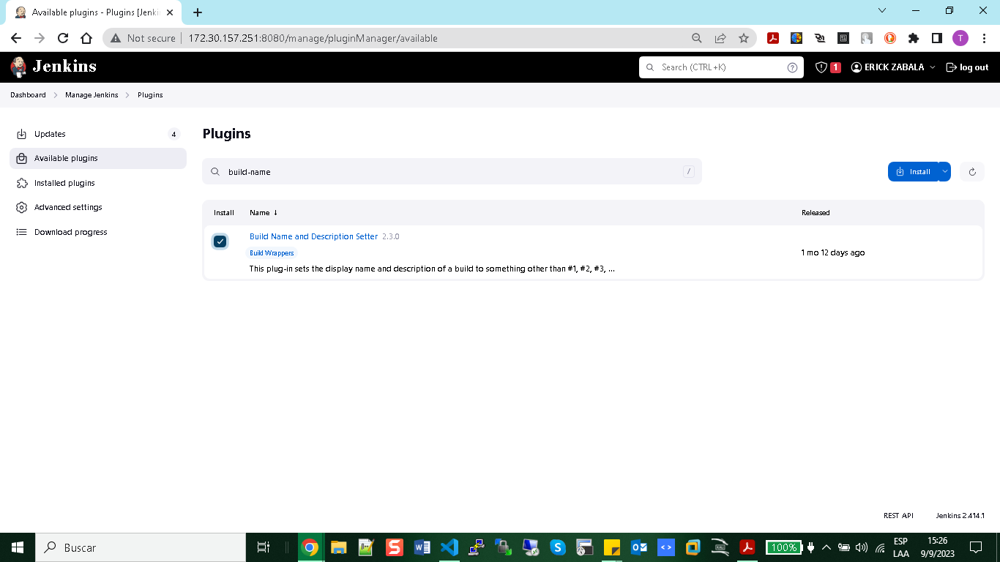

+ Test Result Analizer

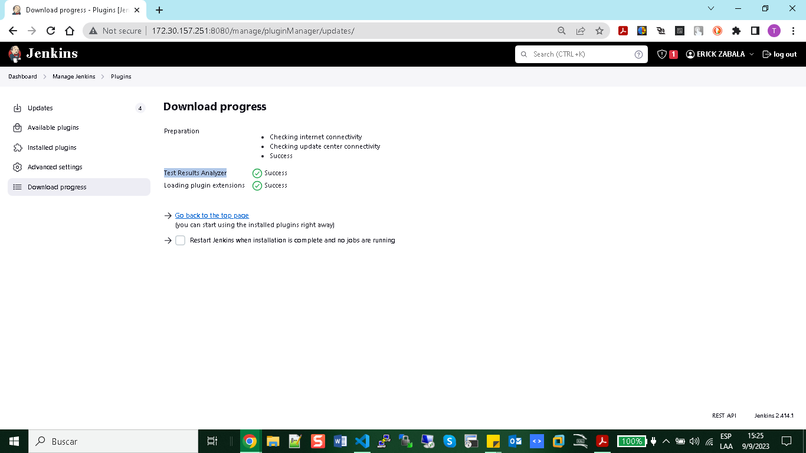

Test Example:

``` python
#!/usr/bin/python3
import pytest

devices = {
    'nx-osv-1': {
        'os': 'nxos_version'
    }
}

def test_version():
    assert devices['nx-osv-1']['os'] == "nxos_version"

```

Output:

```bash
$ python3 -m pytest -v test_device_jenkins.py

    ========= test session starts ==========
platform linux -- Python 3.11.4, pytest-7.4.2, pluggy-1.3.0 -- /usr/bin/python3
cachedir: .pytest_cache
rootdir: /home/devnet/devnet/DEVNET/tdd/network_test
plugins: anyio-3.7.0
collected 1 item                                                            

test_device_jenkins.py::test_version PASSED                                                   [100%]
    ========= 1 passed in 0.68s ==========
```

+ using this comand generate a result.xml file:

```bash
python3 -m pytest --junit-xml=result.xml test_device_jenkins.py 
```

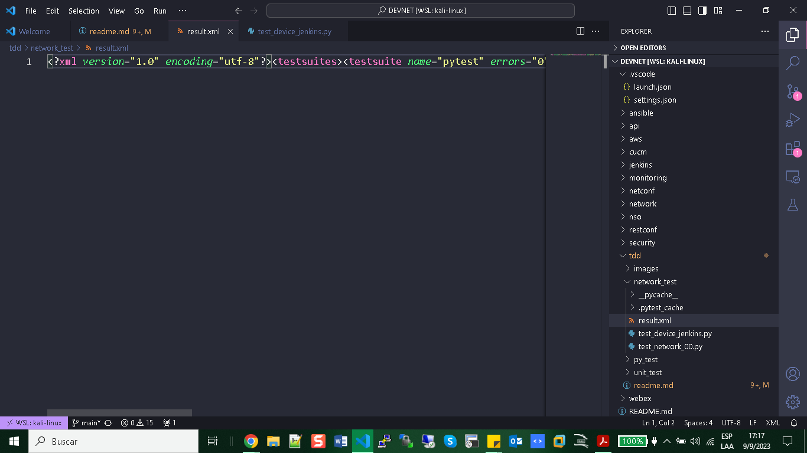

+ You need to create a repository in GitHub to upload your script called test_device_jenkins.py, then create the project in jenkins.

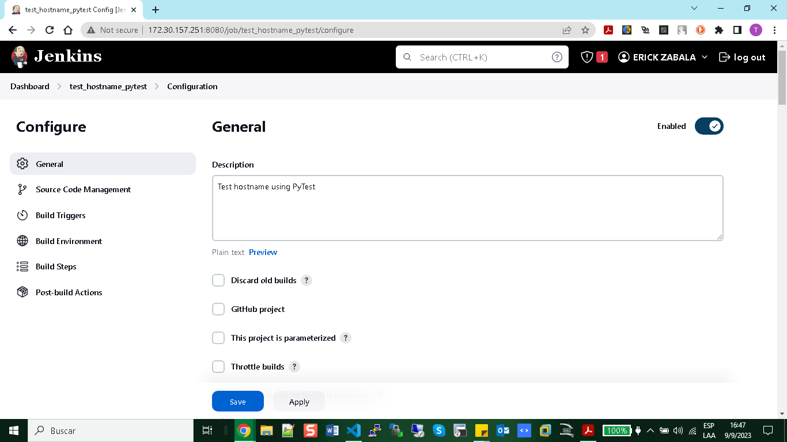
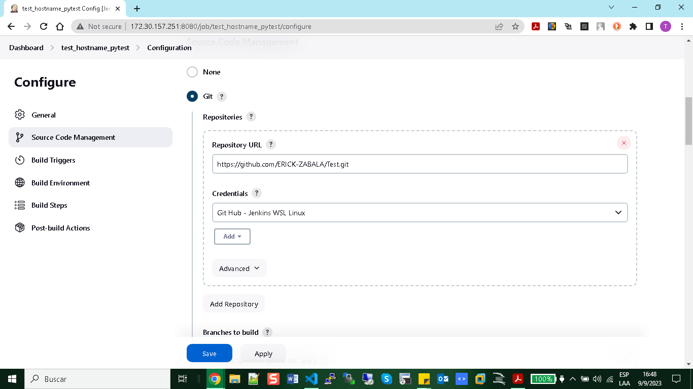
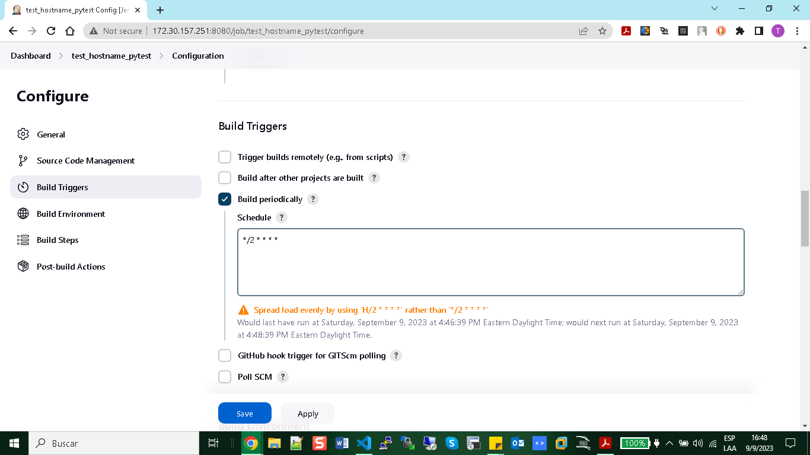
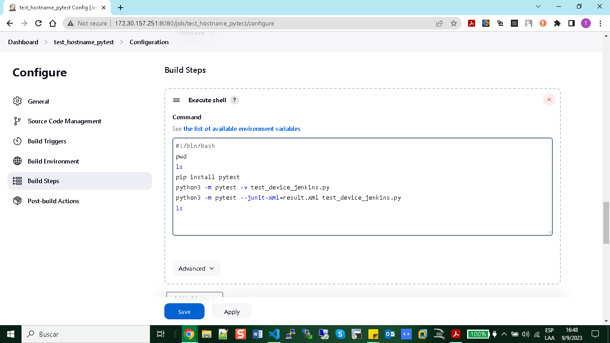
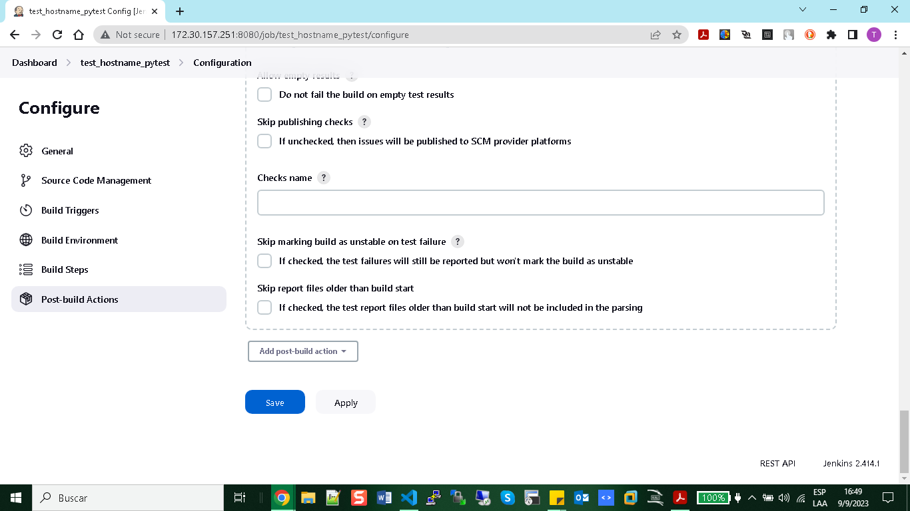

+ Result:

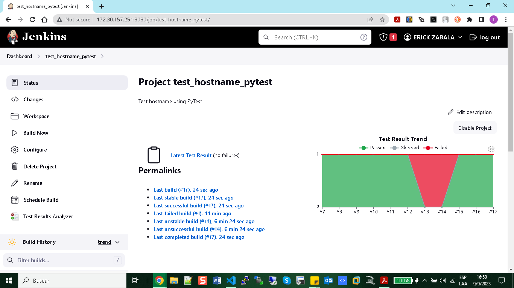
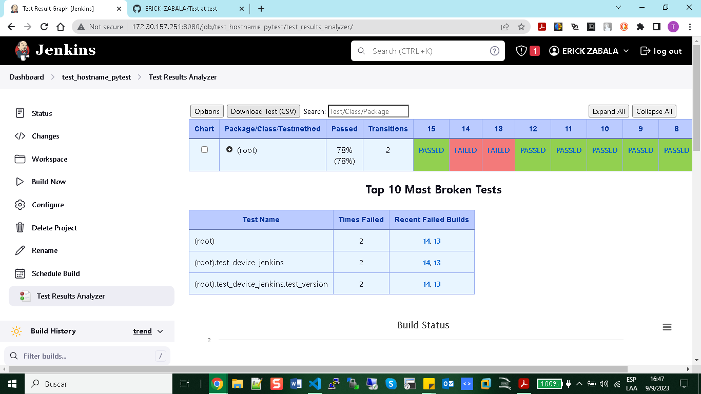

# PyATS and Genie

+ Intall PyATS

```python
pip install pyats
pip install genie 
```

Then you need to generate a test ping using Py ATS using a testbed.yml to connect via ssh to router XR of Cisco - Sandbox.

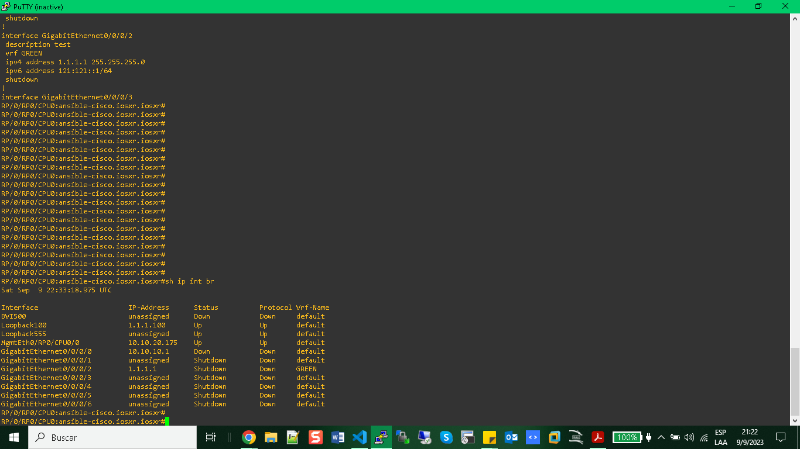

Testbed.yml File:
```yaml

---
testbed:
    name: Py-ATS
    credentials:
      default:
          username: admin
          password: C1sco12345

devices:
    RP/0/RP0/CPU0:ansible-cisco.iosxr.iosxr:
        alias: RP/0/RP0/CPU0:ansible-cisco.iosxr.iosxr
        type: iosxr
        os: iosxr
        connections:
          defaults:
            class: unicon.Unicon
            
          ssh:
            protocol: ssh
            ip: sandbox-iosxr-1.cisco.com
            port: 22
            configure: False
            timeout: 15
          
            
topology:
    RP/0/RP0/CPU0:ansible-cisco.iosxr.iosxr:
        interfaces:
            MgmtEth0/RP0/CPU0/0:
                ipv4: 10.10.20.175/24
                link: link
                type: MgmtEth0/RP0/CPU0/0
            Loopback0:
                ipv4: 1.1.1.100/32
                link: "***TEST LOOPBACK****"
                type: loopback100

```
Code Python:

``` python
from pyats.topology import loader
from pyats import aetest
from genie import testbed

testbed = loader.load('testbed.yml')

testbed.devices

ios_1 = testbed.devices['RP/0/RP0/CPU0:ansible-cisco.iosxr.iosxr']
ios_1.connect(learn_hostname=True, log_stdout=True)

print('xr is connected = ', ios_1.connected)

print('ios versionn = ', ios_1.execute('show version'))

ios_1.disconnect()

class PingTestcase(aetest.Testcase):

    @aetest.setup
    def setup(self):
        self.device = ios_1
    
    @aetest.test.loop(destination=('1.1.1.100', '10.10.20.175'))
    def ping(self, destination):
        
        try:
            result = self.device.ping(destination)
            if result:
                self.passed('Ping to {} was successful'.format(destination))
            else:
                self.failed('Ping to {} failed'.format(destination))
        except Exception as e:
            self.failed('Error while pinging {}: {}'.format(destination, str(e)))

if __name__ == '__main__':
    aetest.main()
```

+ Output: 

``` bash

$ python3 cnx_device_pyats_02.py --testbed cnx_device_pyats_02.py

2023-09-09 21:11:50,859: %UNICON-INFO: +++ RP/0/RP0/CPU0:ansible-cisco.iosxr.iosxr logfile /tmp/RP_0_RP0_CPU0_a
nsible-cisco_iosxr_iosxr-cli-20230909T211150858.log +++                                                        
2023-09-09 21:11:50,859: %UNICON-INFO: +++ Unicon plugin iosxr (unicon.plugins.iosxr) +++

Hello there! Hoping you are having a great day
... Welcome to 'ansible-cisco.iosxr.iosxr',
your favorite CISCO.IOSXR.IOSXR Sandbox


2023-09-09 21:11:51,647: %UNICON-INFO: +++ connection to spawn: ssh -l admin 131.226.217.150 -p 22, id: 1396943
48149328 +++                                                                                                   
2023-09-09 21:11:51,647: %UNICON-INFO: connection to RP/0/RP0/CPU0:ansible-cisco.iosxr.iosxr
(admin@131.226.217.150) Password: 


RP/0/RP0/CPU0:ansible-cisco.iosxr.iosxr#

2023-09-09 21:11:52,217: %UNICON-INFO: Learned hostname(s): 'ansible-cisco.iosxr.iosxr'.

2023-09-09 21:11:52,218: %UNICON-INFO: +++ initializing handle +++

2023-09-09 21:11:52,366: %UNICON-INFO: +++ ansible-cisco.iosxr.iosxr with via 'ssh': executing command 'termina
l length 0' +++                                                                                                terminal length 0
Sun Sep 10 01:06:05.494 UTC
RP/0/RP0/CPU0:ansible-cisco.iosxr.iosxr#

2023-09-09 21:11:52,764: %UNICON-INFO: +++ ansible-cisco.iosxr.iosxr with via 'ssh': executing command 'termina
l width 0' +++                                                                                                 terminal width 0
Sun Sep 10 01:06:05.891 UTC
RP/0/RP0/CPU0:ansible-cisco.iosxr.iosxr#

2023-09-09 21:11:53,019: %UNICON-INFO: +++ ansible-cisco.iosxr.iosxr with via 'ssh': configure +++
configure terminal
Sun Sep 10 01:06:06.286 UTC
RP/0/RP0/CPU0:ansible-cisco.iosxr.iosxr(config)#no logging console
RP/0/RP0/CPU0:ansible-cisco.iosxr.iosxr(config)#logging console disable
RP/0/RP0/CPU0:ansible-cisco.iosxr.iosxr(config)#line console
RP/0/RP0/CPU0:ansible-cisco.iosxr.iosxr(config-line)#exec-timeout 0 0
RP/0/RP0/CPU0:ansible-cisco.iosxr.iosxr(config-line)#absolute-timeout 0
RP/0/RP0/CPU0:ansible-cisco.iosxr.iosxr(config-line)#session-timeout 0
RP/0/RP0/CPU0:ansible-cisco.iosxr.iosxr(config-line)#line default
RP/0/RP0/CPU0:ansible-cisco.iosxr.iosxr(config-line)#exec-timeout 0 0
RP/0/RP0/CPU0:ansible-cisco.iosxr.iosxr(config-line)#absolute-timeout 0
RP/0/RP0/CPU0:ansible-cisco.iosxr.iosxr(config-line)#session-timeout 0
RP/0/RP0/CPU0:ansible-cisco.iosxr.iosxr(config-line)#commit
Sun Sep 10 01:06:07.731 UTC
RP/0/RP0/CPU0:ansible-cisco.iosxr.iosxr(config-line)#end
RP/0/RP0/CPU0:ansible-cisco.iosxr.iosxr#
xrd1 is connected =  True

2023-09-09 21:11:56,339: %UNICON-INFO: +++ ansible-cisco.iosxr.iosxr with via 'ssh': executing command 'show ve
rsion' +++                                                                                                     show version
Sun Sep 10 01:06:09.467 UTC
Cisco IOS XR Software, Version 7.3.2
Copyright (c) 2013-2021 by Cisco Systems, Inc.

Build Information:
 Built By     : ingunawa
 Built On     : Wed Oct 13 20:00:36 PDT 2021
 Built Host   : iox-ucs-017
 Workspace    : /auto/srcarchive17/prod/7.3.2/xrv9k/ws
 Version      : 7.3.2
 Location     : /opt/cisco/XR/packages/
 Label        : 7.3.2-0

cisco IOS-XRv 9000 () processor
System uptime is 3 days 12 hours 1 minute

RP/0/RP0/CPU0:ansible-cisco.iosxr.iosxr#
Sun Sep 10 01:06:09.467 UTC
Cisco IOS XR Software, Version 7.3.2
Copyright (c) 2013-2021 by Cisco Systems, Inc.

Build Information:
 Built By     : ingunawa
 Built On     : Wed Oct 13 20:00:36 PDT 2021
 Built Host   : iox-ucs-017
 Workspace    : /auto/srcarchive17/prod/7.3.2/xrv9k/ws
 Version      : 7.3.2
 Location     : /opt/cisco/XR/packages/
 Label        : 7.3.2-0

cisco IOS-XRv 9000 () processor
System uptime is 3 days 12 hours 1 minute
2023-09-09T21:12:07: %AETEST-INFO: +----------------------------------------------------------------------+
23-09-09T21:12:07: %AETEST-INFO: |       Starting testcase  PingTestcase                     |                                                  2023-09-09T21:12:07: %AETEST-INFO: +-----------------------------------------------------------------------+
                                                                                   2023-09-09T21:12:07: %AETEST-INFO: 
                                                                                    2023-09-09T21:12:07: 
                                                                                    %AETEST-INFO:  
                                                                                    Starting section setup                                                                               2023-09-09T21:12:07: %AETEST-INFO: +---------------------------------------------------------------------------
                                                                                    2023-09-09T21:12:07: %AETEST-INFO: The result of section setup is => PASSED
2023-09-09T21:12:07: %AETEST-INFO: +---------------------------------------------------------------------------
                                                                                    2023-09-09T21:12:07: %AETEST-INFO: |                 
Starting section ping[destination=1.1.1.100]              +---------------------------------------------------------------------------
                        
2023-09-09 21:12:07,608: %UNICON-INFO: +++ ansible-cisco.iosxr.iosxr with via 'ssh': ping +++

2023-09-09 21:12:07,609: %UNICON-WARNING: +++ Reconnecting +++

Hello there! Hoping you are having a great day
... Welcome to 'ansible-cisco.iosxr.iosxr',
your favorite CISCO.IOSXR.IOSXR Sandbox


2023-09-09 21:12:08,375: %UNICON-INFO: +++ connection to spawn: ssh -l admin 131.226.217.150 -p 22, id: 1396943
42974288 +++                                                                                                   
2023-09-09 21:12:08,376: %UNICON-INFO: connection to ansible-cisco.iosxr.iosxr
(admin@131.226.217.150) Password: 


RP/0/RP0/CPU0:ansible-cisco.iosxr.iosxr#

2023-09-09 21:12:08,947: %UNICON-INFO: +++ initializing handle +++

2023-09-09 21:12:09,247: %UNICON-INFO: +++ ansible-cisco.iosxr.iosxr with via 'ssh': executing command 'termina
l length 0' +++                                                                                                terminal length 0
Sun Sep 10 01:06:22.378 UTC
RP/0/RP0/CPU0:ansible-cisco.iosxr.iosxr#

2023-09-09 21:12:09,646: %UNICON-INFO: +++ ansible-cisco.iosxr.iosxr with via 'ssh': executing command 'termina
l width 0' +++                                                                                                 terminal width 0
Sun Sep 10 01:06:22.774 UTC
RP/0/RP0/CPU0:ansible-cisco.iosxr.iosxr#

2023-09-09 21:12:09,902: %UNICON-INFO: +++ ansible-cisco.iosxr.iosxr with via 'ssh': configure +++
configure terminal
Sun Sep 10 01:06:23.203 UTC

RP/0/RP0/CPU0:ansible-cisco.iosxr.iosxr(config)#no logging console
RP/0/RP0/CPU0:ansible-cisco.iosxr.iosxr(config)#logging console disable
RP/0/RP0/CPU0:ansible-cisco.iosxr.iosxr(config)#line console
RP/0/RP0/CPU0:ansible-cisco.iosxr.iosxr(config-line)#exec-timeout 0 0
RP/0/RP0/CPU0:ansible-cisco.iosxr.iosxr(config-line)#absolute-timeout 0
RP/0/RP0/CPU0:ansible-cisco.iosxr.iosxr(config-line)#session-timeout 0
RP/0/RP0/CPU0:ansible-cisco.iosxr.iosxr(config-line)#line default
RP/0/RP0/CPU0:ansible-cisco.iosxr.iosxr(config-line)#exec-timeout 0 0
RP/0/RP0/CPU0:ansible-cisco.iosxr.iosxr(config-line)#absolute-timeout 0
RP/0/RP0/CPU0:ansible-cisco.iosxr.iosxr(config-line)#session-timeout 0
RP/0/RP0/CPU0:ansible-cisco.iosxr.iosxr(config-line)#commit


RP/0/RP0/CPU0:ansible-cisco.iosxr.iosxr(config-line)#end
RP/0/RP0/CPU0:ansible-cisco.iosxr.iosxr#

ping 1.1.1.100
Sun Sep 10 01:06:25.929 UTC
Type escape sequence to abort.
Sending 5, 100-byte ICMP Echos to 1.1.1.100, timeout is 2 seconds:
!!!!!
Success rate is 100 percent (5/5), round-trip min/avg/max = 1/1/1 ms
RP/0/RP0/CPU0:ansible-cisco.iosxr.iosxr#
2023-09-09T21:12:13: %AETEST-INFO: Passed reason: Ping to 1.1.1.100 was successful
2023-09-09T21:12:13: %AETEST-INFO: The result of section ping[destination=1.1.1.100] is => PASSED
...
```

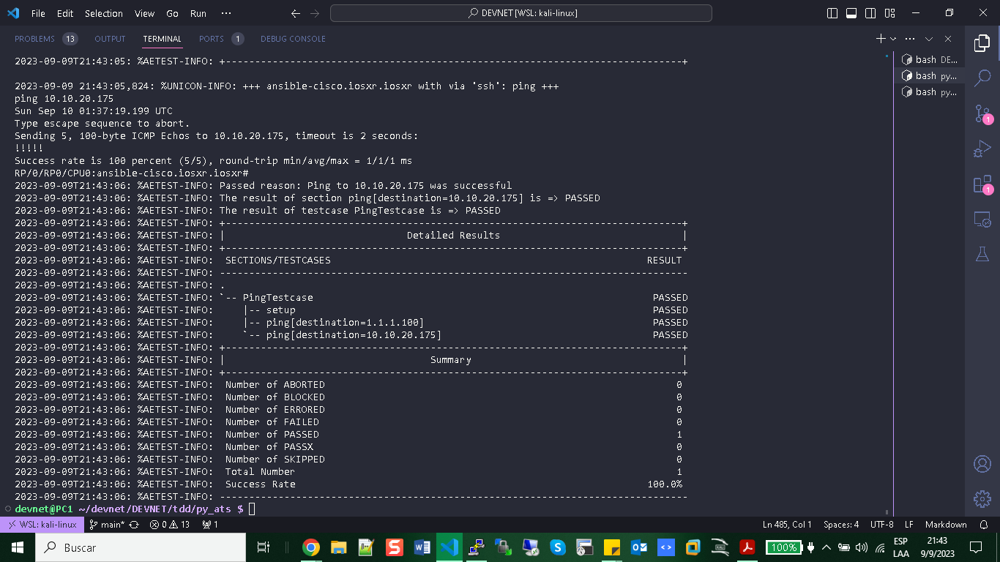